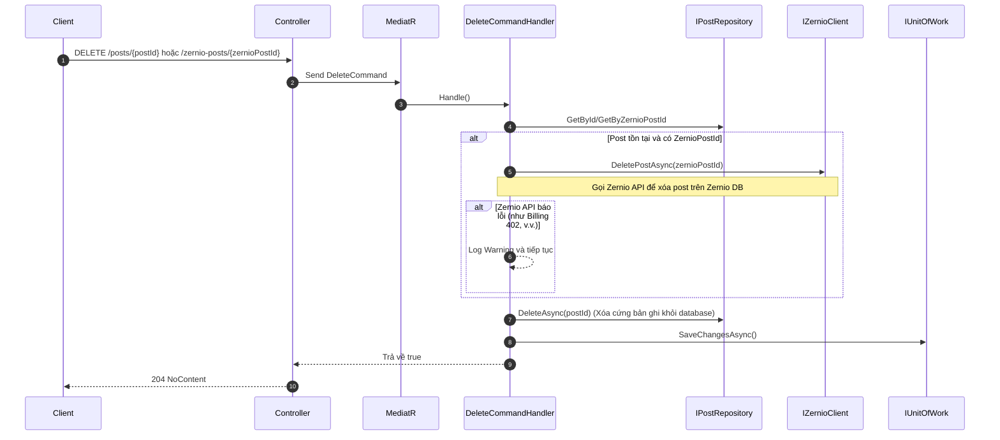
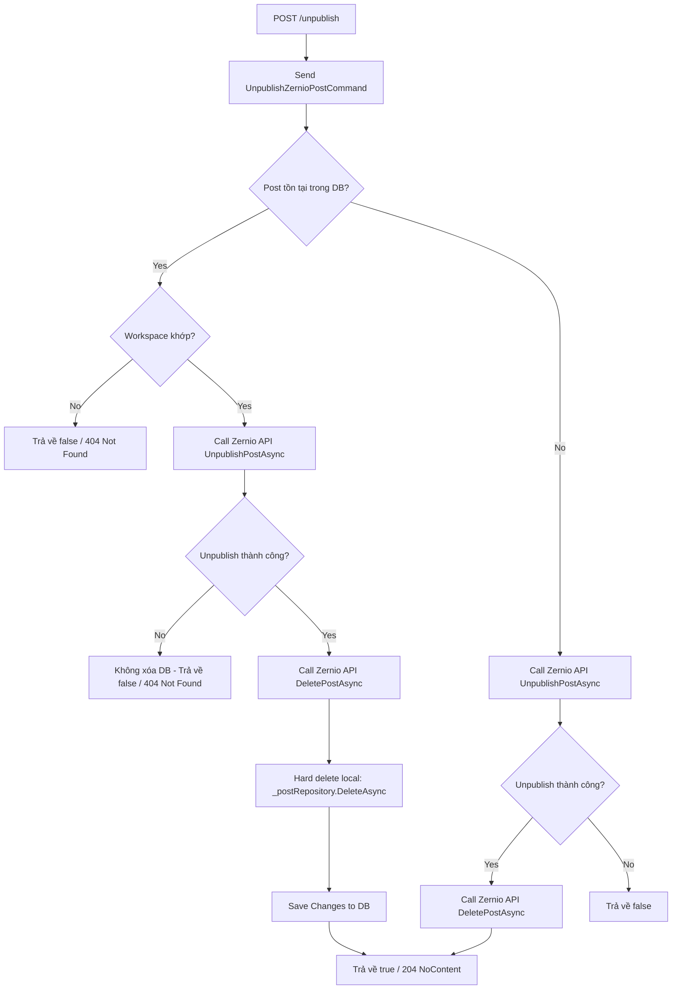

# Post Deletion and Unpublishing Code Flow Report

Bản báo cáo này chi tiết hóa luồng xử lý mã nguồn (code flow) của các endpoint liên quan đến việc **Xóa bài viết (Delete Post)** và **Hủy xuất bản bài viết (Unpublish Post)** trong hệ thống Syncra sử dụng cơ chế **Xóa cứng (Hard Delete)** để đồng bộ dữ liệu.

---

## 1. Luồng xử lý Delete Post (Xóa bài viết)
*Khi người dùng chọn option: **Delete from Syncra only***

Lúc này, hệ thống sẽ thực hiện xóa bài viết khỏi dashboard của Syncra và đồng thời xóa bản ghi bài viết đó bên phía Zernio (Zernio local), nhưng bài viết vẫn giữ nguyên (live) trên các mạng xã hội.

### Luồng xử lý chung của các Endpoint Delete:
1. **Local Delete (`DeletePost`):** `DELETE /api/v1/workspaces/{workspaceId}/posts/{postId}` qua [PostsController.cs:L132-147](file:///D:/Code/Syncra/be/src/Syncra.Api/Controllers/PostsController.cs#L132-L147).
2. **Zernio Delete (`DeleteZernioPost`):** `DELETE /api/v1/workspaces/{workspaceId}/zernio-posts/{zernioPostId}` qua [ZernioPostsController.cs:L100-108](file:///D:/Code/Syncra/be/src/Syncra.Api/Controllers/ZernioPostsController.cs#L100-L108).

Cả hai command handler ([DeletePostCommandHandler.cs](file:///D:/Code/Syncra/be/src/Syncra.Application/Features/Posts/Commands/DeletePostCommandHandler.cs) và [DeleteZernioPostCommandHandler.cs](file:///D:/Code/Syncra/be/src/Syncra.Application/Features/Posts/DeleteZernioPost/DeleteZernioPostCommandHandler.cs)) thực thi các bước sau:

#### Sơ đồ luồng xử lý:

---

## 2. Luồng xử lý Unpublish Post (Hủy xuất bản bài viết)
*Khi người dùng chọn option: **Delete from platform and Syncra***

Khi thực hiện hủy xuất bản, hệ thống sẽ thực hiện gọi Zernio API unpublish trước. **Chỉ khi Unpublish thành công trên nền tảng (Zernio trả về thành công), hệ thống mới thực hiện xóa bài viết bên Zernio và xóa cứng (Hard Delete) record trong database local của Syncra.** Điều này giúp tránh tình trạng lệch dữ liệu giữa Syncra và Zernio.

### Sơ đồ luồng xử lý:

### Chi tiết các bước thực thi trong [UnpublishZernioPostCommandHandler](file:///D:/Code/Syncra/be/src/Syncra.Application/Features/Posts/UnpublishZernioPost/UnpublishZernioPostCommandHandler.cs):
1.  **Truy vấn thông tin bài viết:** Truy vấn từ DB local bằng `ZernioPostId`.
2.  **Xử lý khi Post tồn tại cục bộ trong DB:**
    *   **Xác thực:** Kiểm tra `WorkspaceId`. Nếu không khớp, trả về `false`.
    *   **Gọi Zernio API:** Thực hiện gọi [IZernioClient.UnpublishPostAsync](file:///D:/Code/Syncra/be/src/Syncra.Infrastructure/Services/ZernioClient.cs#L996-L1026).
    *   **Nếu gọi API thất bại (Catch Exception):**
        *   Hệ thống ghi log cảnh báo và **không xóa record trong database cục bộ**, trả về `false` ngay lập tức để tránh lệch dữ liệu.
    *   **Nếu gọi API thành công:**
        *   Gọi API Zernio [DeletePostAsync](file:///D:/Code/Syncra/be/src/Syncra.Infrastructure/Services/ZernioClient.cs#L958-980) để xóa bài viết bên phía Zernio.
        *   Thực hiện xóa cứng bài viết cục bộ bằng cách gọi `_postRepository.DeleteAsync(post.Id)`.
        *   Lưu thay đổi vào database local: `_unitOfWork.SaveChangesAsync()`.
        *   Trả về `true`.
3.  **Xử lý khi Post không tồn tại cục bộ (Dynamic Post):**
    *   Gọi trực tiếp [IZernioClient.UnpublishPostAsync](file:///D:/Code/Syncra/be/src/Syncra.Infrastructure/Services/ZernioClient.cs#L996-L1026).
    *   Nếu gọi API thành công, tiếp tục gọi [IZernioClient.DeletePostAsync](file:///D:/Code/Syncra/be/src/Syncra.Infrastructure/Services/ZernioClient.cs#L958-980) để xóa trên Zernio và trả về `true`.
    *   Nếu unpublish thất bại, trả về `false`.

---

## 3. Thay đổi giao diện người dùng (Frontend UI)

Trong giao diện xác nhận xóa bài viết đã xuất bản ([PostsOverviewPage.tsx](file:///D:/Code/Syncra/fe/src/pages/app/PostsOverviewPage.tsx)):
*   **Bỏ lựa chọn:** *Delete from platform only* (Hủy xuất bản và giữ lại trên dashboard).
*   **Chỉ giữ lại 2 lựa chọn:**
    1.  *Delete from Syncra only* (Xóa khỏi Syncra dashboard và Zernio DB, giữ nguyên live bài viết trên MXH).
    2.  *Delete from platform and Syncra* (Hủy xuất bản trên MXH, xóa khỏi Zernio DB và Syncra dashboard).
*   **Trường hợp bài viết có nhiều nền tảng (Multi-platform posts):**
    *   Lựa chọn *Delete from platform and Syncra* vẫn được hiển thị nếu có ít nhất một nền tảng trong bài viết đó hỗ trợ API unpublishing (ví dụ: Facebook, LinkedIn, v.v.). Lựa chọn này chỉ bị ẩn hoàn toàn khi tất cả các nền tảng của bài viết đều không hỗ trợ (ví dụ: chỉ đăng lên TikTok/Instagram/Snapchat).
    *   Nếu bài viết có chứa nền tảng không hỗ trợ hủy xuất bản qua API (TikTok, Instagram, Snapchat):
        *   Hiển thị thông báo cảnh báo rõ ràng ngay dưới lựa chọn đó: `{PlatformName} doesn't support deletion via API. You'll need to remove it manually.` (hiển thị riêng biệt cho từng nền tảng không hỗ trợ).
        *   Khi người dùng xác nhận chọn *Delete from platform and Syncra*, hệ thống sẽ bỏ qua việc gọi API hủy xuất bản (`UnpublishPostAsync`) đối với các nền tảng không hỗ trợ (tương tự cơ chế của *Delete from Syncra only*), nhưng vẫn gọi API hủy xuất bản cho các nền tảng có hỗ trợ, và cuối cùng thực hiện xóa bài viết khỏi Zernio và database Syncra.
    *   Khi người dùng chọn *Delete from Syncra only*, cơ chế hoạt động giữ nguyên không đổi (xóa bản ghi Syncra DB và Zernio DB, giữ nguyên live bài viết trên tất cả MXH).
