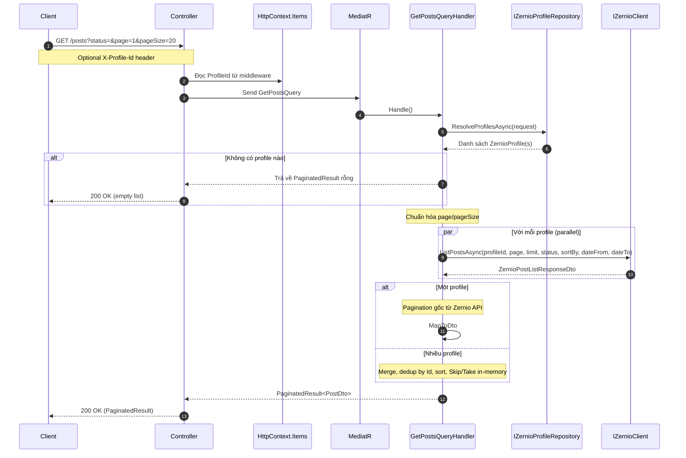
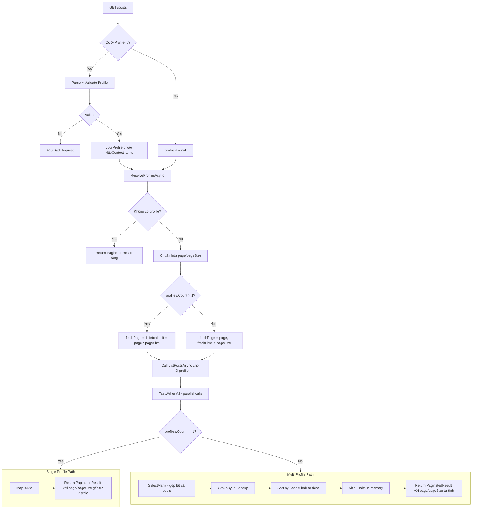
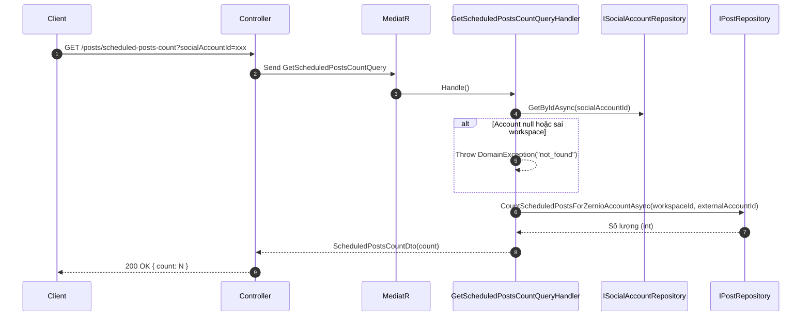
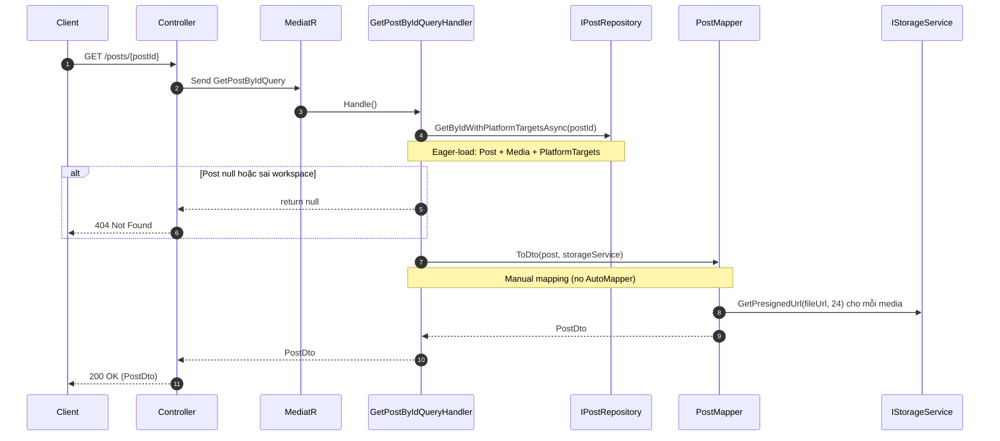

# Post GET Endpoints Code Flow Report

Bản báo cáo này chi tiết hóa luồng xử lý mã nguồn (code flow) của các endpoint **GET** (đọc/lấy dữ liệu) liên quan đến bài viết (Post) trong hệ thống Syncra. Hệ thống sử dụng kiến trúc **MediatR CQRS** với nguồn dữ liệu kết hợp giữa local database (PostgreSQL qua EF Core) và external API từ **Zernio**.

---

## 1. Tổng quan Controllers

### PostsController
- **File:** [PostsController.cs](file:///D:/Code/Syncra/be/src/Syncra.Api/Controllers/PostsController.cs)
- **Route prefix:** `api/v1/workspaces/{workspaceId}/posts`
- **Auth:** `[Authorize]` (JWT required, line 11)
- **DI:** `IMediator` qua constructor (line 18-21)

Controller này chứa **3 GET endpoints** (lines 48-100) và các endpoints khác (POST/PUT/DELETE — lines 23-147).

### ZernioPostsController
- **File:** [ZernioPostsController.cs](file:///D:/Code/Syncra/be/src/Syncra.Api/Controllers/ZernioPostsController.cs)
- **Route prefix:** `api/v1/workspaces/{workspaceId}/zernio-posts`
- **GET endpoints:** **Không có.** Controller này chỉ xử lý ghi (POST create, PUT update, POST retry, DELETE, POST unpublish).

---

## 2. Endpoint A: `GET api/v1/workspaces/{workspaceId}/posts`

*Lấy danh sách bài viết dạng phân trang (paginated list).*

| Thuộc tính | Giá trị |
|---|---|
| **Controller method** | `GetPosts` (lines 48-72) |
| **Route** | `[HttpGet]` — không có sub-path |
| **Query params** | `status` (string?), `scheduledFromUtc` (DateTime?), `scheduledToUtc` (DateTime?), `page` (int, default 1), `pageSize` (int, default 20) |
| **Auth** | JWT + optional `X-Profile-Id` header |
| **Nguồn dữ liệu** | **Zernio API** (`ListPostsAsync`) |

### Xử lý Profile Resolution

Trước khi vào controller, nếu request có header `X-Profile-Id`, middleware [ProfileResolutionMiddleware.cs](file:///D:/Code/Syncra/be/src/Syncra.Api/Middleware/ProfileResolutionMiddleware.cs) (lines 29-86) sẽ:

1. **Bỏ qua** nếu path là Auth hoặc User/me (line 32-37).
2. **Kiểm tra header** `X-Profile-Id` (line 40): nếu không có → pass qua, `profileId` là `null`.
3. **Parse GUID** (line 48): nếu không hợp lệ → trả về 400.
4. **Lấy WorkspaceId** từ `HttpContext.Items` (do `TenantResolutionMiddleware` set, line 57).
5. **Xác thực profile** thuộc workspace và còn active (line 70-72): nếu không hợp lệ → trả về 403.
6. **Lưu** `profileId` vào `HttpContext.Items["ProfileId"]` (line 83).

Tại controller (line 58): `var profileId = HttpContext.Items["ProfileId"] as Guid?`.

### Luồng xử lý chi tiết



### Sơ đồ Flowchart chi tiết



### Chi tiết các bước thực thi trong [GetPostsQueryHandler](file:///D:/Code/Syncra/be/src/Syncra.Application/Features/Posts/Queries/GetPostsQueryHandler.cs):

1. **ResolveProfilesAsync** (lines 103-113):
   - Nếu `request.ProfileId` có giá trị → fetch profile cụ thể từ `IZernioProfileRepository.GetByIdAsync`.
   - Nếu không → fetch **tất cả active profiles** của workspace qua `GetActiveByWorkspaceIdAsync`.
   - Nếu không có profile → trả về `PaginatedResult` rỗng (line 34-35).

2. **Chuẩn hóa pagination** (lines 37-38): `page` min 1, `pageSize` clamp 1-100, default 20.

3. **Xác định chiến lược batch** (lines 40-42):
   - **Nhiều profile** (>1): fetch `page 1` với `page * pageSize` items mỗi profile → merge + paginate in-memory.
   - **Một profile**: forward thẳng page/pageSize xuống Zernio API.

4. **Gọi Zernio API song song** (lines 44-53):
   ```csharp
   var tasks = profiles.Select(p => _zernioClient.ListPostsAsync(
       profileId: p.ZernioProfileId,
       page: fetchPage, limit: fetchLimit,
       status: request.Status?.ToLowerInvariant(),
       sortBy: "scheduled-desc",
       dateFrom: request.ScheduledFromUtc, dateTo: request.ScheduledToUtc,
       cancellationToken: cancellationToken));
   var results = await Task.WhenAll(tasks);
   ```

5. **Mapping** — `MapToDto` (lines 115-145):
   - Chuyển `ZernioPostListItemDto` → `PostDto`.
   - Chuyển Zernio ObjectId (string) → Guid xác định qua `MD5.HashData(Encoding.UTF8.GetBytes(objectId))` (lines 147-150).
   - Tạo presigned URLs cho media qua `_storageService.GetPresignedUrl(m.Url, 24)` (24h expiry).
   - Map platform targets kèm error messages, status, accountId, platformSpecificData.

### Xử lý lỗi Zernio API

| Điều kiện | File:Line | Hành vi |
|---|---|---|
| HTTP 402 (Payment Required) | [ZernioClient.cs:1116-1122](file:///D:/Code/Syncra/be/src/Syncra.Infrastructure/Services/ZernioClient.cs#L1116-L1122) | Throw `ZernioBillingRequiredException` — yêu cầu paid plan |
| Lỗi khác | [ZernioClient.cs:1124-1128](file:///D:/Code/Syncra/be/src/Syncra.Infrastructure/Services/ZernioClient.cs#L1124-L1128) | Throw `DomainException("zernio_list_posts_error")` |

---

## 3. Endpoint B: `GET api/v1/workspaces/{workspaceId}/posts/scheduled-posts-count`

*Lấy số lượng bài viết đã scheduled cho một social account cụ thể.*

| Thuộc tính | Giá trị |
|---|---|
| **Controller method** | `GetScheduledPostsCount` (lines 74-83) |
| **Route** | `[HttpGet("scheduled-posts-count")]` |
| **Query params** | `socialAccountId` (Guid, required) |
| **Auth** | JWT authorized |
| **Nguồn dữ liệu** | **Local DB** (`Post` table) |

### Luồng xử lý



### Chi tiết các bước thực thi trong [GetScheduledPostsCountQueryHandler](file:///D:/Code/Syncra/be/src/Syncra.Application/Features/Posts/Queries/GetScheduledPostsCountQueryHandler.cs):

1. **Validate social account** (lines 26-30):
   - Fetch account từ `ISocialAccountRepository.GetByIdAsync(request.SocialAccountId)`.
   - Nếu `null` hoặc `account.WorkspaceId != request.WorkspaceId` → throw `DomainException("not_found", "Social account not found.")`.

2. **Count scheduled posts** (lines 32-35):
   - Gọi `_postRepository.CountScheduledPostsForZernioAccountAsync(workspaceId, account.ExternalAccountId, ct)`.
   - Dùng `ExternalAccountId` (Zernio-side account ID), không phải local DB ID.

3. **Response** (line 37):
   - `new ScheduledPostsCountDto(count)` — simple wrapper `{ Count: int }`.

---

## 4. Endpoint C: `GET api/v1/workspaces/{workspaceId}/posts/{postId:guid}`

*Lấy chi tiết một bài viết từ local database.*

| Thuộc tính | Giá trị |
|---|---|
| **Controller method** | `GetPostById` (lines 85-100) |
| **Route** | `[HttpGet("{postId:guid}")]` — GUID constraint |
| **Path params** | `workspaceId` (Guid), `postId` (Guid) |
| **Auth** | JWT authorized |
| **Nguồn dữ liệu** | **Local DB** (`Post` table với eager-load Media, PlatformTargets) |
| **404 handling** | Line 94-97: nếu result null → `NotFound()` |

### Luồng xử lý



### Chi tiết các bước thực thi trong [GetPostByIdQueryHandler](file:///D:/Code/Syncra/be/src/Syncra.Application/Features/Posts/Queries/GetPostByIdQueryHandler.cs):

1. **Fetch từ repository** (line 21):
   - `_postRepository.GetByIdWithPlatformTargetsAsync(request.PostId)` — eager-load `Post` entity với `Media`, `Integration`, và `PlatformTargets`.

2. **Workspace ownership check** (line 22):
   - Nếu `post is null` HOẶC `post.WorkspaceId != request.WorkspaceId` → return `null` → controller trả về 404.

3. **Mapping** (line 27):
   - `PostMapper.ToDto(post, _storageService)` — static mapper không dùng AutoMapper.
   - Chi tiết mapping tại [PostMapper.cs](file:///D:/Code/Syncra/be/src/Syncra.Application/Features/Posts/PostMapper.cs) (lines 9-33):
     - Map entity properties thủ công: `post.Title.Value`, `post.Content.Value`, `post.ScheduledAt.UtcValue`.
     - Tạo presigned URLs cho từng media item: `storageService.GetPresignedUrl(m.FileUrl, 24)`.
     - Map `PlatformTargets` từ `ICollection<PostPlatformTarget>` → `List<PostPlatformTargetDto>`.
     - Status output: `post.Status.ToString()` (enum to string).

---

## 5. Chiến lược Mapping

**Không sử dụng AutoMapper** trong codebase. Mapping thủ công (manual) được dùng xuyên suốt:

| Endpoint | Mapper | File:Line | Nguồn → Đích |
|---|---|---|---|
| **GET /posts** (list) | `MapToDto` (private method) | [GetPostsQueryHandler.cs:115-145](file:///D:/Code/Syncra/be/src/Syncra.Application/Features/Posts/Queries/GetPostsQueryHandler.cs#L115-L145) | `ZernioPostListItemDto` → `PostDto` |
| **GET /posts/{postId}** | `PostMapper.ToDto` (static) | [PostMapper.cs:9-33](file:///D:/Code/Syncra/be/src/Syncra.Application/Features/Posts/PostMapper.cs#L9-L33) | `Post` (domain entity) → `PostDto` |
| **GET /scheduled-posts-count** | Không | — | `int` → `ScheduledPostsCountDto` |

**Cách chuyển đổi ObjectId sang Guid (GetPosts list):**
- `MD5.HashData(Encoding.UTF8.GetBytes(objectId))` → `new Guid(bytes)` (lines 147-150).
- Đây là deterministic hash (không phải cryptographic), đảm bảo cùng ObjectId luôn ra cùng Guid.

---

## 6. Các điểm quyết định (Decision Points)

### GetPosts (list)

| Điểm quyết định | File:Line | Hành vi |
|---|---|---|
| Không có profile nào active | [GetPostsQueryHandler.cs:34-35](file:///D:/Code/Syncra/be/src/Syncra.Application/Features/Posts/Queries/GetPostsQueryHandler.cs#L34-L35) | Trả về `PaginatedResult` rỗng |
| Page hoặc PageSize không hợp lệ | [GetPostsQueryHandler.cs:37-38](file:///D:/Code/Syncra/be/src/Syncra.Application/Features/Posts/Queries/GetPostsQueryHandler.cs#L37-L38) | Clamp về giá trị mặc định |
| Nhiều profiles (>1) | [GetPostsQueryHandler.cs:40-42](file:///D:/Code/Syncra/be/src/Syncra.Application/Features/Posts/Queries/GetPostsQueryHandler.cs#L40-L42) | Fetch nhiều data, merge + paginate in-memory |
| Zernio API 402 | [ZernioClient.cs:1116-1122](file:///D:/Code/Syncra/be/src/Syncra.Infrastructure/Services/ZernioClient.cs#L1116-L1122) | Throw `ZernioBillingRequiredException` |
| Zernio API lỗi khác | [ZernioClient.cs:1124-1128](file:///D:/Code/Syncra/be/src/Syncra.Infrastructure/Services/ZernioClient.cs#L1124-L1128) | Throw `DomainException("zernio_list_posts_error")` |

### GetPostById (single)

| Điểm quyết định | File:Line | Hành vi |
|---|---|---|
| Post không tồn tại hoặc sai workspace | [GetPostByIdQueryHandler.cs:22-25](file:///D:/Code/Syncra/be/src/Syncra.Application/Features/Posts/Queries/GetPostByIdQueryHandler.cs#L22-L25) | Return null → Controller trả về 404 |
| Eager-load Media + PlatformTargets | [IPostRepository.cs:44-48](file:///D:/Code/Syncra/be/src/Syncra.Domain/Interfaces/IPostRepository.cs#L44-L48) | `GetByIdWithPlatformTargetsAsync` |

### GetScheduledPostsCount

| Điểm quyết định | File:Line | Hành vi |
|---|---|---|
| Social account không tồn tại / sai workspace | [GetScheduledPostsCountQueryHandler.cs:27-30](file:///D:/Code/Syncra/be/src/Syncra.Application/Features/Posts/Queries/GetScheduledPostsCountQueryHandler.cs#L27-L30) | Throw `DomainException("not_found")` |

---

## 7. Mối quan hệ: Local Posts Table vs Zernio External API

Hệ thống sử dụng mô hình **hybrid**:

| Khía cạnh | Local `Post` Table | Zernio External API |
|---|---|---|
| **GET /posts** (list) | Không dùng | Đọc toàn bộ danh sách từ `ListPostsAsync` |
| **GET /posts/{postId}** | Đọc từ `Post` entity (eager-load Media, PlatformTargets) | Không dùng |
| **GET /scheduled-posts-count** | Đếm local Post records theo workspace + Zernio account ID | Không dùng |
| **CreatePost** (POST) | Ghi local `Post` record | Tuỳ chọn: tạo Zernio post nếu publish |
| **ZernioPostId** | Lưu dạng nullable string trên `Post` entity | Link giữa local post và Zernio post |

**Key insight:** `GET /posts` không đọc từ local `Post` table — đọc hoàn toàn từ Zernio API. `GET /posts/{postId}` chỉ đọc từ local `Post` table. Hai endpoint này phục vụ các nguồn dữ liệu khác nhau.

---

## 8. Bảng tổng kết

| # | Endpoint | Method | File:Line | Query | Handler | Data Source |
|---|---|---|---|---|---|---|
| 1 | `GET api/v1/workspaces/{workspaceId}/posts` | `GetPosts` | [PostsController.cs:48-72](file:///D:/Code/Syncra/be/src/Syncra.Api/Controllers/PostsController.cs#L48-L72) | `GetPostsQuery` | `GetPostsQueryHandler` | Zernio API (`ListPostsAsync`) |
| 2 | `GET api/v1/workspaces/{workspaceId}/posts/scheduled-posts-count` | `GetScheduledPostsCount` | [PostsController.cs:74-83](file:///D:/Code/Syncra/be/src/Syncra.Api/Controllers/PostsController.cs#L74-L83) | `GetScheduledPostsCountQuery` | `GetScheduledPostsCountQueryHandler` | Local `Post` table (count) |
| 3 | `GET api/v1/workspaces/{workspaceId}/posts/{postId:guid}` | `GetPostById` | [PostsController.cs:85-100](file:///D:/Code/Syncra/be/src/Syncra.Api/Controllers/PostsController.cs#L85-L100) | `GetPostByIdQuery` | `GetPostByIdQueryHandler` | Local `Post` table (eager-load) |

---

## 9. Danh sách file

| File | Lines | Purpose |
|---|---|---|
| [PostsController.cs](file:///D:/Code/Syncra/be/src/Syncra.Api/Controllers/PostsController.cs) | 148 | Controller: 3 GET + POST/PUT/DELETE endpoints |
| [ZernioPostsController.cs](file:///D:/Code/Syncra/be/src/Syncra.Api/Controllers/ZernioPostsController.cs) | 126 | Zernio-specific controller, KHÔNG có GET endpoints |
| [ProfileResolutionMiddleware.cs](file:///D:/Code/Syncra/be/src/Syncra.Api/Middleware/ProfileResolutionMiddleware.cs) | 87 | Resolves `X-Profile-Id` header → `HttpContext.Items["ProfileId"]` |
| [GetPostsQuery.cs](file:///D:/Code/Syncra/be/src/Syncra.Application/Features/Posts/Queries/GetPostsQuery.cs) | 15 | Query record: filters + pagination |
| [GetPostsQueryHandler.cs](file:///D:/Code/Syncra/be/src/Syncra.Application/Features/Posts/Queries/GetPostsQueryHandler.cs) | 138 | Handler: Zernio API fetch + merge + mapping |
| [GetPostByIdQuery.cs](file:///D:/Code/Syncra/be/src/Syncra.Application/Features/Posts/Queries/GetPostByIdQuery.cs) | 9 | Query record by workspace+id |
| [GetPostByIdQueryHandler.cs](file:///D:/Code/Syncra/be/src/Syncra.Application/Features/Posts/Queries/GetPostByIdQueryHandler.cs) | 29 | Handler: local DB fetch + PostMapper |
| [GetScheduledPostsCountQuery.cs](file:///D:/Code/Syncra/be/src/Syncra.Application/Features/Posts/Queries/GetScheduledPostsCountQuery.cs) | 9 | Query record by workspace+socialAccount |
| [GetScheduledPostsCountQueryHandler.cs](file:///D:/Code/Syncra/be/src/Syncra.Application/Features/Posts/Queries/GetScheduledPostsCountQueryHandler.cs) | 39 | Handler: validate account + count local posts |
| [PostMapper.cs](file:///D:/Code/Syncra/be/src/Syncra.Application/Features/Posts/PostMapper.cs) | 56 | Static DTO mapper (no AutoMapper) |
| [PostDto.cs](file:///D:/Code/Syncra/be/src/Syncra.Application/DTOs/Posts/PostDto.cs) | 33 | DTOs: `PostDto`, `PostMediaItemDto`, `PostPlatformTargetDto` |
| [ScheduledPostsCountDto.cs](file:///D:/Code/Syncra/be/src/Syncra.Application/DTOs/Posts/ScheduledPostsCountDto.cs) | 3 | Simple count DTO |
| [PaginatedResult.cs](file:///D:/Code/Syncra/be/src/Syncra.Application/DTOs/PaginatedResult.cs) | 11 | Generic paged response wrapper |
| [IPostRepository.cs](file:///D:/Code/Syncra/be/src/Syncra.Domain/Interfaces/IPostRepository.cs) | 51 | Repository interface |
| [IZernioClient.cs](file:///D:/Code/Syncra/be/src/Syncra.Application/Interfaces/IZernioClient.cs) | 644 | Interface: `ListPostsAsync` (line 114) |
| [ZernioClient.cs](file:///D:/Code/Syncra/be/src/Syncra.Infrastructure/Services/ZernioClient.cs) | 2256+ | Implementation: raw HTTP → Zernio API |
