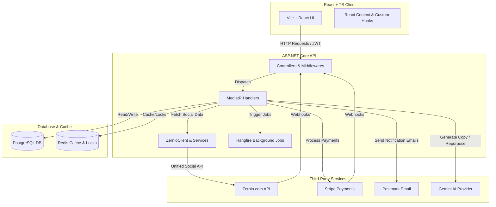

# Syncra System Architecture

This document provides a comprehensive overview of the **Syncra** system architecture, technology stack, and module specifications. Syncra is a robust workspace automation and social media management platform that integrates **TikTok**, **Facebook**, **LinkedIn**, and **YouTube** using unified middleware APIs from [zernio.com](https://zernio.com).

---

## ── Architecture Overview ──

---

## ── Technology Stack ──

### 1. Frontend
* **Core**: React 18, TypeScript, Vite.
* **Styling**: Vanilla CSS Modules (custom spacing/variables) and Tailwind CSS.
* **State & Routing**: React Context, React Router, TanStack Query (for data fetching and caching).
* **Charts & Visuals**: Recharts (for Analytics visualization).

### 2. Backend
* **Core**: ASP.NET Core 8.0 (Clean Architecture pattern).
* **MediatR**: In-process messaging to separate API endpoints from business logic.
* **FluentValidation**: Input request validation pipelines.
* **Background Processing**: Hangfire (dev dashboard accessible on `/hangfire`) backed by PostgreSQL storage.
* **Logging & Observability**: Serilog (structured console/file logging) and Sentry SDK integration.

### 3. Database & Caching
* **Primary Database**: PostgreSQL accessed through **Entity Framework Core (EF Core)** code-first migrations.
* **Distributed Cache**: Redis (for analytical query caching and distributed locks).

### 4. Third-Party Integrations
* **zernio.com**: Unified social media API middleware, handling authorization URLs, account metadata, posting, analytics, and inbox webhooks/comments for all platforms.
* **Stripe**: Pricing plan subscriptions, billing checkouts, and customer portals.
* **Postmark**: Direct transaction email service for user verification and password resets.
* **Gemini API**: AI-powered content repurposing and strategy generation.

---

## ── System Modules ──

Syncra is divided into 7 core modules, each with strict input, output, and dependency boundary rules.

### 1. Authentication (Auth) Module
Manages user registrations, logins, verification emails, password resets, and session tokens.
* **Input**:
  * User credentials (Email, Password)
  * Account verification tokens
  * Password reset tokens
* **Output**:
  * JSON Web Tokens (JWT) for secure authentication
  * HTTP-only cookies
  * Verification/reset status response
* **Dependencies**:
  * ASP.NET Core Identity & Entity Framework Core
  * `ITokenService` (JWT generation)
  * `IPostmarkEmailService` (sending transaction emails)
  * PostgreSQL Database (`Users` table)

### 2. Social Connections (OAuth) Module
Handles the lifecycle of connecting, disconnecting, and checking the health of social media accounts through Zernio's OAuth pipelines.
* **Input**:
  * Platform requested to connect (TikTok, Facebook, LinkedIn, YouTube)
  * Authorization code received from the callback redirect
  * Redirection URL parameters
* **Output**:
  * Connection health status / authorization health checks
  * Persisted account credentials in the DB (encrypted)
  * OAuth URLs for front-end redirection
* **Dependencies**:
  * `IZernioClient` (calling Zernio APIs for connect URLs and health)
  * `GoogleTokenService` (YouTube OAuth token handling and refreshes)
  * `ISocialAccountRepository`
  * PostgreSQL Database (`SocialAccounts` table)

### 3. Content Publishing (Post) Module
Supports drafting, scheduling, publishing immediately, editing, and deleting posts across selected social platforms.
* **Input**:
  * Post details: Content text, scheduled time, media attachments (images/videos)
  * Target platforms (e.g., Facebook page, LinkedIn organization, TikTok, YouTube)
  * Platform-specific configurations (e.g., TikTok slideshow settings, YouTube playlist IDs)
* **Output**:
  * Hangfire background job registrations
  * Zernio publishing request payloads
  * Real-time post state updates (`Draft`, `Scheduled`, `Published`, `Failed`)
* **Dependencies**:
  * `IZernioClient` (creating, updating, and uploading media to Zernio)
  * `IBackgroundJobClient` (Hangfire scheduling)
  * `IPostRepository`
  * PostgreSQL Database (`Posts` and `PostPlatforms` tables)

### 4. Social & Video Analytics Module
Pulls engagement metrics, audience demographics, and daily trends from connected channels and formats them for dashboard charts.
* **Input**:
  * Filter criteria: Date ranges, profile/page identifiers
  * Requested metrics (views, reach, follower counts, demographic age/gender)
* **Output**:
  * Standardized JSON structures containing time-series analytics, follow history, views, and reactions.
* **Dependencies**:
  * `IZernioClient` (analytical data retrievals)
  * `ZernioAnalyticsValidator` (checks range limits, valid metrics, and platform rules)
  * `IAnalyticsCacheService` (Redis cache to prevent excessive third-party API calls)

### 5. Unified Inbox & Comments Module
Allows creators to view, reply, and filter comments and messages across all connected channels from a single workspace view.
* **Input**:
  * Social account credentials
  * Reply text, comment IDs, or message payloads
  * Filter query parameters (read/unread, platform, account)
* **Output**:
  * Unified thread logs of comments, mentions, and private replies
  * SignalR real-time messaging events
* **Dependencies**:
  * `IZernioClient` (fetching and posting comments/messages)
  * `IInMemoryInboxCommentListCacheService` (fast retrieval caches)
  * SignalR Hubs (`NotificationHub`)

### 6. AI Repurposer Module
Uses AI prompt engineering to transform user-submitted draft content or links into highly optimized formats for alternative platforms.
* **Input**:
  * Source content (raw text, articles)
  * Target platforms (e.g., convert a LinkedIn post to a TikTok video script)
  * Tone parameters
* **Output**:
  * Platform-specific content drafts, scripts, suggestions, and hashtags.
* **Dependencies**:
  * `IGeminiProvider` (calls Google's Gemini models)
  * `IPromptEngineeringService` (appends platform hooks and character constraints)
  * `IRepurposeCacheService`

### 7. Billing & Subscriptions Module
Restricts premium features (like advanced analytics and unified inbox) based on Stripe payments and subscription limits.
* **Input**:
  * Subscription plan selection (Pricing Tier, Billing Period)
  * Payment details (handled by Stripe checkout)
  * Stripe webhook payload events (successful charges, failed renewals, cancellations)
* **Output**:
  * Redirect links to Stripe Checkout / Customer Billing Portal
  * Updated user subscription status in the application database
* **Dependencies**:
  * `IStripeService` & `PaymentWebhookOrchestrator`
  * PostgreSQL Database (`Subscriptions` and `TenantWorkspaces` tables)
  * `GlobalExceptionMiddleware` (handles throwing `ZernioBillingRequiredException` to gate premium API access)
