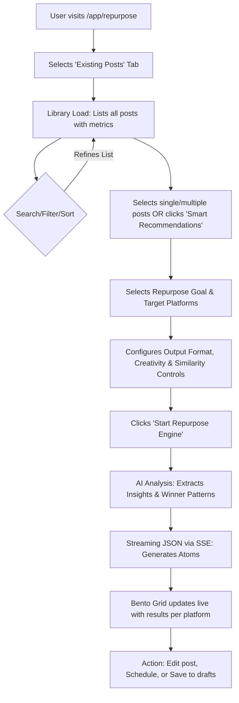
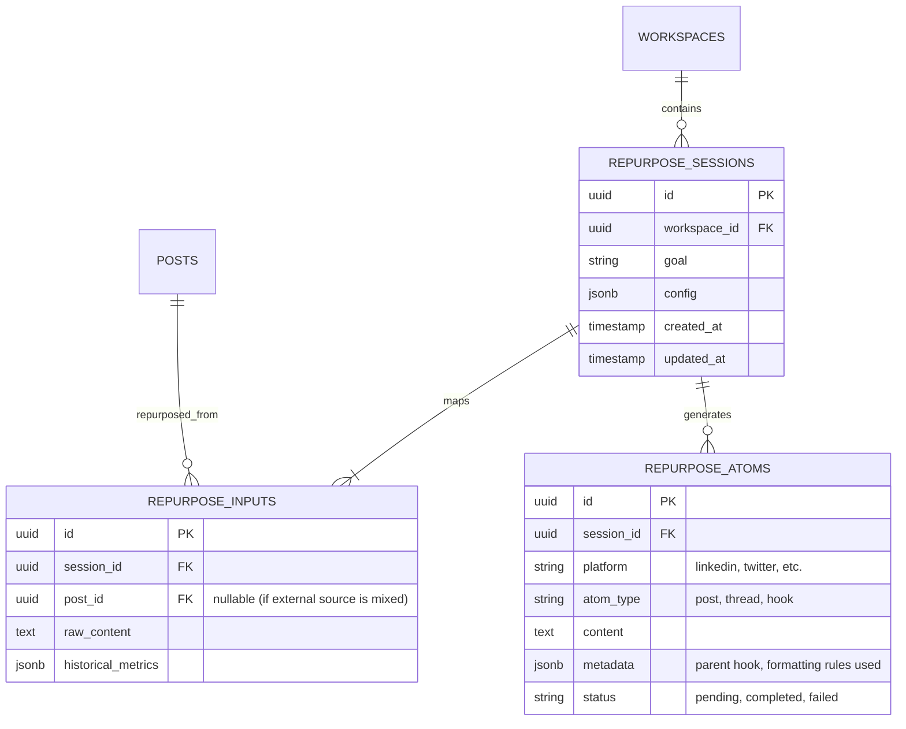

# Product Specification: Repurpose From Existing Posts

This document defines the complete product specification, user experience, and technical architecture for the "Repurpose From Existing Posts" feature inside Syncra.

---

## 1. Product Overview

The "Repurpose From Existing Posts" feature allows users to leverage their historical, published, and draft content library to automatically generate high-performing, multi-platform social media posts. Instead of starting from scratch or manually copying text, users can select one or more of their own past posts to rewrite, expand, cross-pollinate to other channels, or convert into serialized content.

### Objectives
- **Maximize Content Value**: Reuse proven ideas, hooks, and structures without manually copy-pasting.
- **Scale at Ease**: Generate 5 to 100+ unique, high-quality post variations in a single operation.
- **Maintain Contextual Quality**: Use historical analytics data (likes, comments, reach) to let the AI learn what resonates with the audience and apply those patterns to new content.
- **Streamline Workflow**: Directly schedule generated outputs or send them to the Draft box within Syncra.

---

## 2. User Stories

### Content Library & Selection
- **US-1.1**: As a Content Creator, I want to view all my previous posts (drafts, scheduled, published) inside the repurpose page so that I don't have to navigate back and forth to copy my content.
- **US-1.2**: As a Brand Manager, I want to search and filter my posts by keyword, platform, campaign, tags, and date range so that I can quickly locate specific content I want to repurpose.
- **US-1.3**: As a Social Media Specialist, I want to sort my posts by engagement metrics (likes, comments, shares, highest reach) so that I can easily identify my top-performing "winner" posts.
- **US-1.4**: As a Power User, I want to select single, multiple, or all filtered posts (bulk selection) to use as the input context for the repurposing engine.

### AI Configuration & Goals
- **US-2.1**: As a Content Strategist, I want to choose between multiple repurposing goals (e.g., Create Variations, Cross-Platform Repurposing, Content Expansion, Series Creation, Topic Expansion) to guide how the AI transforms my content.
- **US-2.2**: As a Multi-Channel Creator, I want to choose the target platforms, output format type (social posts, threads, newsletter, video scripts), and quantity of outputs so that I can feed all my social channels from a single source.
- **US-2.3**: As a Copywriter, I want control over the creativity level (Conservative, Balanced, Aggressive) and similarity level (20%, 40%, 60%, 80%) to ensure the outputs feel fresh and avoid being duplicate rewrites.

### AI Engine Insights
- **US-3.1**: As a User, I want the system to analyze my post content, metadata, and performance metrics automatically, ranking insights from high-performing posts higher.
- **US-3.2**: As a User, I want to receive proactive recommendations of "Posts most worth repurposing" (Smart Post Picker), "Successful hook & tone structures" (Winner Pattern Analysis), "Missing content pillars" (Content Gap Analysis), and "Outdated evergreen updates" (Evergreen Revival).

---

## 3. Functional Requirements

### 3.1 Content Source Integration
- Introduce a new **"Existing Posts"** tab alongside *Paste Text*, *URL Import*, and *File Upload* in `/app/repurpose`.
- Fetch the user's workspace posts from `GET /api/v1/workspaces/{workspaceId}/posts` asynchronously on page load or tab active.
- Display post cards in a clean grid/list with pagination, containing post previews, platforms, status, and performance badges.

### 3.2 Library Querying and Filtering
- **Keyword Search**: Server-side full-text search against the post's text content.
- **Filters**:
  - `Platforms`: Multi-select dropdown (LinkedIn, Twitter, Facebook, Instagram, YouTube, Threads).
  - `Date Range`: Date picker for publication dates (`scheduledFor` / `publishedAt`).
  - `Tags / Campaigns`: Dropdown multi-select based on workspace taxonomy.
  - `Status`: Filter by `Published`, `Draft`, `Scheduled`, or `Failed`.
- **Sorting**: Dropdown options:
  - `Latest` / `Oldest`
  - `Most Engaged` (computed score: `Likes + Comments * 2 + Shares * 3`)
  - `Most Comments`
  - `Most Shares`
  - `Highest Reach` / `Impressions`

### 3.3 Target Configuration & AI Controls
- **Repurpose Goals Selection**:
  - `Create Variations`: 1 source post $\rightarrow$ multiple variations (different hooks/CTAs/tones).
  - `Cross Platform`: Map selected post format to selected target platforms.
  - `Content Expansion`: Turn 5-10 posts into a 30-day content plan or campaign.
  - `Series Creation`: Transform 1 rich post into a sequential multi-part series.
  - `Topic Expansion`: Extract core insights and generate new perspectives, frameworks, counter-arguments, or educational posts.
- **AI Output Parameters**:
  - `Output Count`: Number slider or input (min: 1, max: 100, subject to tier limits).
  - `Output Format Type`: Multi-select (Social Posts, Threads, Carousel content, Hooks, Scripts, Newsletter).
  - `Creativity (Temperature)`: Conservative (0.2), Balanced (0.7), Aggressive (1.0).
  - `Similarity Threshold`: 80% (direct rewrite) down to 20% (entirely new angles using only the core topic).

### 3.4 AI Analysis & Generation Execution
- **Insight Extraction Engine**: Instead of feeding raw post text directly to prompts, extract core thoughts, frameworks, and stories first into structured JSON.
- **Winner Pattern Recognition**: Feed performance metrics and templates of high-performing posts into the context. The engine prioritizes replicating the hook and structure of posts that achieved high engagement.
- **Streaming Generation**: Use Server-Sent Events (SSE) to stream partial JSON results (atoms) live to the Bento grid.

---

## 4. UX Flow



### User Journey Detailed Steps
1. **Entry**: The user navigates to `Repurpose` via the sidebar or command palette. They select the `Existing Posts` tab.
2. **Browsing**: The content library displays a list of posts. A top recommendation banner suggests "Winner Posts to Repurpose Today" using Feature 1 (Smart Post Picker).
3. **Selection**: User checks the checkbox on 3 successful LinkedIn posts.
4. **Configuration**: On the left panel, the user chooses "Cross Platform Repurposing" and selects "Twitter" and "Threads" as target outputs. They set similarity to "40% (Fresh Angles)" and output format to "Threads".
5. **Execution**: User clicks "Start Repurpose Engine".
6. **Observation**: A skeleton card appears, streaming content character-by-character.
7. **Resolution**: Once completed, the user reviews a 5-tweet thread. They click "Schedule" which pre-fills the composer with the generated text, ready to schedule.

---

## 5. UI Components

### 5.1 Content Library Grid & Post Cards
- **`PostLibraryGrid`**: Wraps search, filter, and sorting bars. Handles paginated display of `PostLibraryCard`.
- **`PostLibraryCard`**:
  - Displays platform icon, publication status, date.
  - Snippet of the post text.
  - Analytics badges: Likes, Comments, Shares, Engagement Rate (ER).
  - Checkbox in the top-left corner for selection.
  - Click to preview modal showing full text and historical comments.

### 5.2 Recommendation Banners
- **`SmartPickerAlert`**: Dismissible card at the top of the library with recommendations like:
  > **🔥 Smart Picker Recommendation**:
  > Your post "5 mistakes developers make in API design" had 4.2x higher engagement than average. Repurpose this into a 5-day thread series or an Instagram carousel!
  > `[ Select Post & Repurpose ]`

### 5.3 Left Panel Configuration Controls
- **`RepurposeGoalSelector`**: A styled radio card list detailing goals A, B, C, D, E with icons.
- **`SimilaritySlider`**: Slider containing markers for 20%, 40%, 60%, 80% with explanatory text labels (e.g. "20% - Concept Only", "80% - Close Rewrite").
- **`CreativitySelector`**: Tabs for Conservative, Balanced, and Aggressive.

### 5.4 Active Streaming & Results Layout
- **`BentoResultsGrid`**: Layout showing generated content blocks categorized by platform.
- **`StreamingAtomCard`**: Custom UI with a progress meter indicating SSE completion. Highlights the text being generated in real-time. Includes buttons to copy, edit, schedule, or regenerate.

---

## 6. AI Capabilities (Gemini 2.5 Flash / Google AI SDK)

The AI features leverage **Gemini 2.5 Flash** due to its fast response speeds, long context window (ideal for large sets of historical posts), and JSON schema mode capabilities.

### Feature 1: Smart Post Picker
- **Algorithm**: Runs a lightweight background job (or inline evaluation) analyzing metrics.
- **Scoring**: $Score = \text{Likes} + (\text{Comments} \times 2) + (\text{Shares} \times 3)$.
- **Selection**: Selects posts where $Score > 1.5 \times \text{Average Workspace Score}$ and `PublishedAt` is older than 30 days (avoid spamming the same topic too frequently).

### Feature 2: Winner Pattern Analysis
- **Execution**: Extracts formatting rules from top 5% performing posts.
- **Output**: Detects:
  - Hooks: "Does the user start with a question, a bold statement, or statistics?"
  - Paragraph Length: Average sentence count.
  - CTAs: Links, newsletter prompts, or comment-to-DM hooks.
- **Context Injection**: These guidelines are appended to system instructions when generating new content.

### Feature 3: Content Gap Analysis
- **Execution**: Clusters previous posts by topic category.
- **Output**: Identifies which core themes (e.g., Tech Tutorials, Personal Stories, Hiring) have been neglected recently and prompts the user to write content under those pillars.

### Feature 4: Evergreen Revival
- **Execution**: Filters posts marked as `#evergreen` or automatically classifies posts. Returns posts older than 90 days that have high historical conversion.
- **Output**: Re-evaluates content, rewrites statistics/dates to match the current year (e.g., converting "Vite in 2025" to "Vite in 2026").

### Feature 5: Insight Extraction Engine
- Before generating final posts, the raw selected posts are passed to Gemini to extract a **"Truth & Knowledge Base"** JSON:
```json
{
  "insights": [
    {
      "coreIdea": "Software harnesses make coding agents 2x more efficient.",
      "evidence": "Observed team velocity double after introducing AGENTS.md.",
      "counterIntuitiveAngle": "Prompts are not the problem; the repo layout is."
    }
  ]
}
```
The final posts are synthesized from this structured JSON, ensuring high conceptual similarity without duplicating the exact syntax of the original post.

---

## 7. Database Design

We will extend the Syncra PostgreSQL database schema with tables to store sessions, selected inputs, configurations, and generated content.



### Table Schema Definitions

#### Table: `RepurposeSessions`
- `Id`: `UUID` (Primary Key, default: `gen_random_uuid()`)
- `WorkspaceId`: `UUID` (Foreign Key -> `Workspaces.Id`, Indexed)
- `Goal`: `VARCHAR(50)` (e.g. `CreateVariations`, `CrossPlatform`, `ContentExpansion`)
- `Config`: `JSONB` (Stores: similarity level, creativity, output count, target platforms, tones)
- `CreatedAtUtc`: `TIMESTAMP WITH TIME ZONE` (Default: `now()`)
- `UpdatedAtUtc`: `TIMESTAMP WITH TIME ZONE`

#### Table: `RepurposeInputs`
- `Id`: `UUID` (Primary Key)
- `SessionId`: `UUID` (Foreign Key -> `RepurposeSessions.Id`, Cascade Delete)
- `PostId`: `UUID` (Foreign Key -> `Posts.Id`, Nullable, Cascade Set Null)
- `RawContent`: `TEXT` (Snapshotted content to prevent issues if original post is edited or deleted)
- `HistoricalMetrics`: `JSONB` (Snapshotted likes, comments, shares, etc.)

#### Table: `RepurposeAtoms`
- `Id`: `UUID` (Primary Key)
- `SessionId`: `UUID` (Foreign Key -> `RepurposeSessions.Id`, Cascade Delete)
- `Platform`: `VARCHAR(50)` (Target social platform)
- `AtomType`: `VARCHAR(50)` (Format: `Post`, `Thread`, `Newsletter`, etc.)
- `Content`: `TEXT`
- `Status`: `VARCHAR(20)` (`Pending`, `Streaming`, `Completed`, `Failed`)
- `CreatedAtUtc`: `TIMESTAMP WITH TIME ZONE`

### Database Performance Considerations
- **Index**: Add index on `RepurposeSessions(WorkspaceId, CreatedAtUtc DESC)`.
- **Index**: Add composite index on `RepurposeAtoms(SessionId, Platform)`.
- **Index**: Add GIN index on `RepurposeSessions(Config)` if querying specific tones or target platforms across history is needed.

---

## 8. Backend Architecture

The backend will follow Clean Architecture principles implemented in C# (.NET Core).

### 8.1 API Controller (`RepurposeController.cs`)
Expose the following endpoints:
- `GET /api/v1/workspaces/{workspaceId}/repurpose/posts`: Lists available historical posts with metrics.
- `POST /api/v1/workspaces/{workspaceId}/repurpose/generate-from-posts`: Submits chosen posts and configuration to kickstart the generation session.
- `GET /api/v1/workspaces/{workspaceId}/repurpose/sessions`: Lists historical repurposing runs.
- `GET /api/v1/workspaces/{workspaceId}/repurpose/sessions/{sessionId}`: Details of a run.

### 8.2 Execution Service Layer
- **`AIRepurposeService.cs`**: Orchestrates data assembly, retrieves metric scores, interacts with Gemini, and manages server-sent event streams.
- **`PromptEngineeringService.cs`**: Constructs prompts injecting winner patterns, brand rules, similarity guidelines, and structured JSON constraints.
- **`GeminiProvider.cs`**: Handles the API integration with Google Gemini 2.5 Flash, processing token streams and handling retries/rate limit exceptions.

---

## 9. AI Workflow & Prompting Strategy

### 9.1 Prompting Context Assembly

To preserve brand voice and leverage winners, we formulate the prompt with three layers of context:

```text
[System Instructions]
- You are a social media copywriter specialized in [Target Platforms].
- You write with a [Creativity Level] tone.
- Your target similarity to source is [Similarity Level]%.

[Winner Formatting Guide]
- Use these structure styles derived from top-performing posts:
  * Hook Style: [Hook Type]
  * Formatting: [Length/Formatting Constraints]

[Knowledge Base (Insight Engine Extract)]
- Core Insights to repurpose:
  1. [Insight 1]
  2. [Insight 2]

[Target Output Configuration]
- Output Goal: [Goal]
- Output Format: [Format]
- Platforms: [Platforms]
- Generate [N] variations.
```

### 9.2 Structured JSON Schema Output
To enable safe streaming parsing, we configure Gemini to output JSON conforming to this schema:

```json
{
  "type": "object",
  "properties": {
    "atoms": {
      "type": "array",
      "items": {
        "type": "object",
        "properties": {
          "platform": { "type": "string", "enum": ["linkedin", "twitter", "facebook", "instagram"] },
          "type": { "type": "string", "enum": ["post", "thread", "hook", "carousel"] },
          "content": { "type": "string" },
          "reasoning": { "type": "string" }
        },
        "required": ["platform", "type", "content"]
      }
    }
  }
}
```

We parse this stream as it arrives using a partial JSON parser to feed the UI.

---

## 10. Edge Cases

| Edge Case | Description | Mitigation Strategy |
| --- | --- | --- |
| **No historical posts** | Workspace is brand new with zero posts. | Display an empty-state tutorial showing how to import from text/URL first, or write their first draft. |
| **No performance metrics** | Posts exist but social APIs haven't returned engagement details. | Default to sorting by date. Use general copywriting best practices instead of specific winner pattern analysis. |
| **Input exceeds context limit** | Bulk-selecting 100+ posts overflows context. | Truncate selections based on performance scores. Keep the top 20 highest-performing posts and discard the rest. |
| **AI fails mid-stream** | Connection drops during SSE stream. | Persist successfully completed atoms to the database; display a "Partial success" message with a "Retry remaining" action button. |
| **Plagiarism / Duplication** | High similarity results in search engine penalties. | Introduce a strict "Similarity Check" pass: if similarity control is low (e.g. 20%), run a vector embedding similarity check against inputs, forcing regeneration if similarity is too high. |

---

## 11. Permission Model

Syncra features collaborative multi-tenancy. Access to the content repurposing library is governed by the following roles:

- **Workspace Admin**: Full access. Can view, select, repurpose all historical posts, and delete repurpose history.
- **Editor**: Can view, select, and repurpose all posts. Cannot delete session history.
- **Creator (Draft Only)**: Can browse posts and run generations, but can only save results as drafts. Cannot schedule posts directly.
- **Viewer**: Read-only access to library. Cannot trigger the repurpose engine.

---

## 12. Scalability Strategy

To support workspaces containing up to 100,000+ historical posts:
1. **Incremental Indexing**: Sync post metrics to a localized PostgreSQL table. Never run live API calls to social platforms (LinkedIn/Twitter) during a user's search.
2. **Context Window Optimization**: Don't inject full texts of 1,000 posts. First, use a vector-based semantic search to find posts related to the user's search query, select the top 20, and only inject those into the Gemini prompt.
3. **Background Processing**: For generation counts $> 20$ or bulk requests, execute the generation inside a Hangfire background queue. Send a toast/push notification to the user when the content is ready, rather than holding an active SSE connection open.

---

## 13. Monetization Opportunities (Tier Limits)

To drive upgrades, we will partition features based on subscription plans:

- **Free Tier**: Up to 5 posts selected, max 3 outputs per run, default tone, no analytics metrics considered.
- **Creator Tier**: Up to 20 posts selected, max 10 outputs per run, custom tones, winner pattern analysis enabled.
- **Agency Tier**: Unlimited post selection, up to 100 outputs per run, Smart Post Picker, Content Gap Analysis, Evergreen Revival, and background batch generation.

---

## 14. Future Enhancements

- **Direct Comment Repurposing**: Extract high-value replies and discussions from historical comment sections and turn them into full posts.
- **A/B Testing Loops**: Automatically monitor the performance of new repurposed outputs and dynamically update the Winner Pattern database.
- **Visual Asset Repurposing**: Feed existing image creatives into Gemini 2.5 Flash's multimodal input to generate matching captions and graphic briefs.

---

## 15. Implementation Roadmap

### Phase 1: Core Layout & Data Fetching (Weeks 1-2)
- [fe] Create the "Existing Posts" source tab.
- [fe] Add grid, search, filters, and selection states.
- [be] Add endpoints to list workspace posts with filters and sort metrics.

### Phase 2: AI Orchestration & UI Streams (Weeks 3-4)
- [be] Implement `AIRepurposeService` integration with Gemini 2.5 Flash.
- [be] Build the SSE streaming controller and JSON output schema validation.
- [fe] Bind bento results grid to SSE events, showing live generation progress.

### Phase 3: Winner Analytics & Smart Algorithms (Weeks 5-6)
- [be] Implement Winner Pattern Analysis & Smart Post Picker algorithms.
- [be] Create Database tables for `RepurposeSessions`, `Inputs`, and `Atoms`.
- [fe] Implement recommendations banner and goal controls.

### Phase 4: Verification & Polishing (Week 7)
- [qa] Run load testing on 10,000+ posts datasets.
- [qa] Validate prompt quality under strict similarity/creativity configurations.
- [release] General availability release.
