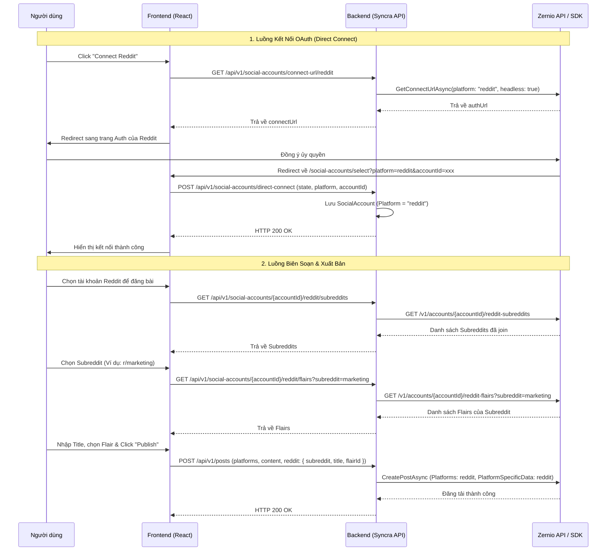

# Thiết Kế Tích Hợp Reddit Platform Qua Zernio SDK

Tài liệu này mô tả chi tiết phương án thiết kế, phân tích mã nguồn và các bước triển khai kỹ thuật để tích hợp mạng xã hội **Reddit** vào nền tảng Syncra thông qua **Zernio SDK**.

---

## 1. Tổng Quan Kiến Trúc Tích Hợp Reddit

Reddit đã được Zernio hỗ trợ thông qua API của họ cho hai tính năng chính là **Publishing (Post)** và **Inbox (Comments)**. Việc tích hợp Reddit vào Syncra sẽ tận dụng lại hệ thống trừu tượng hóa OAuth và Đăng tải (Publishing) của Zernio để giảm thiểu tối đa việc tích hợp Reddit API trực tiếp.

### Điểm khác biệt lớn nhất của Reddit so với các nền tảng khác:
1. **Subreddit**: Một bài viết Reddit không đăng trực tiếp lên tường cá nhân (Profile) mà bắt buộc phải đăng vào một cộng đồng (Subreddit) cụ thể.
2. **Flair**: Nhiều Subreddit yêu cầu bài viết phải có nhãn phân loại (Flair) cụ thể thì mới cho phép xuất bản.
3. **Tiêu đề bài viết (Post Title)**: Reddit yêu cầu bài viết bắt buộc phải có tiêu đề, khác với các nền tảng như Facebook hay LinkedIn chỉ cần Caption.

---

## 2. Phân Tích Mã Nguồn Hiện Tại & Tác Động

Hệ thống Syncra đã được thiết kế rất tốt để sẵn sàng mở rộng các nền tảng của Zernio:

### A. Backend (ASP.NET Core 8.0)
* **Thực thể Domain & DB**: Các thực thể như [SocialAccount.cs](file:///D:/Code/Syncra/be/src/Syncra.Domain/Entities/SocialAccount.cs) và [PostPlatformTarget.cs](file:///D:/Code/Syncra/be/src/Syncra.Domain/Entities/PostPlatformTarget.cs) lưu trữ tên nền tảng dưới dạng chuỗi thường (`platform.ToLowerInvariant()`), vì vậy không bị giới hạn bởi enum cứng ở tầng DB.
* **DTO Mapped**: [ZernioPlatformDataDtos.cs](file:///D:/Code/Syncra/be/src/Syncra.Application/DTOs/Zernio/ZernioPlatformDataDtos.cs#L230-L239) đã định nghĩa đầy đủ `RedditPlatformDataDto` khớp với schema của Zernio bao gồm: `subreddit`, `title`, `url`, `forceSelf`, `flairId`, `nativeVideo`, `videogif`, `videoPosterUrl`.
* **Mapper Client**: [ZernioClient.cs](file:///D:/Code/Syncra/be/src/Syncra.Infrastructure/Services/ZernioClient.cs#L1169-L1170) đã hỗ trợ map dữ liệu đặc thù Reddit sang Zernio SDK:
  ```csharp
  "reddit" => request.PlatformSpecificData?.Reddit
      ?? new RedditPlatformDataDto(Subreddit: "", Title: request.Title ?? ""),
  ```
* **Inbox Webhook**: [ProcessZernioWebhookJob.cs](file:///D:/Code/Syncra/be/src/Syncra.Infrastructure/Jobs/ProcessZernioWebhookJob.cs#L1119) đã tự động map trường `Subreddit` từ webhook của Zernio vào bảng `InboxCommentedPost`.

### B. Frontend (Vite + React)
* **Platform Configuration**: [ConnectionsPage.tsx](file:///D:/Code/Syncra/fe/src/pages/app/ConnectionsPage.tsx#L40) đang đánh dấu Reddit là `isSupported: false`.
* **Sub-Entity Type**: Reddit không thuộc nhóm `SUB_ENTITY_PLATFORMS` (như Facebook Page hay LinkedIn Org) nên sẽ đi theo luồng **Direct Connect** (kết nối trực tiếp tài khoản cá nhân tương tự TikTok và YouTube).
* **Composer Form**: [PlatformSpecificForm.tsx](file:///D:/Code/Syncra/fe/src/components/create-post/PlatformSpecificForm.tsx#L2033) đã định nghĩa sẵn component `RedditForm` nhưng các trường chọn Subreddit và Flair đang được mock bằng `TodoSelect`.

---

## 3. Thiết Kế Chi Tiết Giao Diện & API (Technical Design)

Hạng mục công việc chính cần thực hiện tập trung vào việc **bật kết nối Reddit**, **xây dựng API lấy danh sách Subreddit/Flair từ Zernio**, và **nâng cấp UI Composer**.



### A. Backend - Bổ Sung API Lấy Subreddit & Flair từ Zernio

Chúng ta cần định nghĩa các DTO và interface để gọi API Zernio (các endpoint `/v1/accounts/{accountId}/reddit-subreddits` và `/v1/accounts/{accountId}/reddit-flairs` đã khai báo trong [zernio-api-openapi.yaml](file:///D:/Code/Syncra/zernio-api-openapi.yaml#L15032)).

#### 1. Thêm DTOs trong [ZernioDtos.cs](file:///D:/Code/Syncra/be/src/Syncra.Application/DTOs/Zernio/ZernioDtos.cs)
```csharp
// Reddit Subreddits
public sealed record ZernioRedditSubredditItemDto(
    [property: JsonPropertyName("id")] string Id,
    [property: JsonPropertyName("name")] string Name,
    [property: JsonPropertyName("title")] string Title,
    [property: JsonPropertyName("url")] string Url,
    [property: JsonPropertyName("over18")] bool Over18
);

public sealed record ZernioRedditSubredditsResponseDto(
    [property: JsonPropertyName("subreddits")] IReadOnlyList<ZernioRedditSubredditItemDto> Subreddits,
    [property: JsonPropertyName("defaultSubreddit")] string? DefaultSubreddit
);

// Reddit Flairs
public sealed record ZernioRedditFlairItemDto(
    [property: JsonPropertyName("id")] string Id,
    [property: JsonPropertyName("text")] string Text,
    [property: JsonPropertyName("textColor")] string TextColor,
    [property: JsonPropertyName("backgroundColor")] string BackgroundColor
);

public sealed record ZernioRedditFlairsResponseDto(
    [property: JsonPropertyName("flairs")] IReadOnlyList<ZernioRedditFlairItemDto> Flairs
);
```

#### 2. Thêm Phương Thức Vào Interface [IZernioClient.cs](file:///D:/Code/Syncra/be/src/Syncra.Application/Interfaces/IZernioClient.cs)
```csharp
Task<ZernioRedditSubredditsResponseDto> GetRedditSubredditsAsync(
    string accountId,
    CancellationToken cancellationToken = default);

Task<ZernioRedditFlairsResponseDto> GetRedditFlairsAsync(
    string accountId,
    string subreddit,
    CancellationToken cancellationToken = default);
```

#### 3. Triển Khai Trong [ZernioClient.cs](file:///D:/Code/Syncra/be/src/Syncra.Infrastructure/Services/ZernioClient.cs)
Sử dụng `ConnectApi` của Zernio SDK (đã được generate sẵn từ OpenAPI Spec):
```csharp
public async Task<ZernioRedditSubredditsResponseDto> GetRedditSubredditsAsync(
    string accountId,
    CancellationToken cancellationToken = default)
{
    try
    {
        // Gọi API Zernio SDK: /v1/accounts/{accountId}/reddit-subreddits
        var response = await _connectApi.GetRedditSubredditsAsync(accountId, cancellationToken);
        
        var subreddits = response.Subreddits.Select(s => new ZernioRedditSubredditItemDto(
            Id: s.Id,
            Name: s.Name,
            Title: s.Title,
            Url: s.Url,
            Over18: s.Over18 ?? false
        )).ToList();

        return new ZernioRedditSubredditsResponseDto(subreddits, response.DefaultSubreddit);
    }
    catch (ApiException ex)
    {
        _logger.LogError(ex, "Zernio API error fetching Reddit subreddits for account {AccountId}", accountId);
        throw new DomainException("zernio_reddit_subreddits_error", "Failed to fetch Reddit subreddits via Zernio", ex);
    }
}

public async Task<ZernioRedditFlairsResponseDto> GetRedditFlairsAsync(
    string accountId,
    string subreddit,
    CancellationToken cancellationToken = default)
{
    try
    {
        // Gọi API Zernio SDK: /v1/accounts/{accountId}/reddit-flairs
        var response = await _connectApi.GetRedditFlairsAsync(accountId, subreddit, cancellationToken);

        var flairs = response.Flairs.Select(f => new ZernioRedditFlairItemDto(
            Id: f.Id,
            Text: f.Text,
            TextColor: f.TextColor,
            BackgroundColor: f.BackgroundColor
        )).ToList();

        return new ZernioRedditFlairsResponseDto(flairs);
    }
    catch (ApiException ex)
    {
        _logger.LogError(ex, "Zernio API error fetching Reddit flairs for subreddit {Subreddit} on account {AccountId}", subreddit, accountId);
        throw new DomainException("zernio_reddit_flairs_error", "Failed to fetch Reddit flairs via Zernio", ex);
    }
}
```

#### 4. Thêm Endpoints Trong [SocialAccountsController.cs](file:///D:/Code/Syncra/be/src/Syncra.Api/Controllers/SocialAccountsController.cs)
```csharp
// ── GET /api/v1/social-accounts/{accountId}/reddit/subreddits ──────
[HttpGet("{accountId:guid}/reddit/subreddits")]
public async Task<IActionResult> GetRedditSubreddits(
    Guid accountId,
    CancellationToken cancellationToken = default)
{
    var workspaceId = HttpContext.Items[Middleware.TenantResolutionMiddleware.WorkspaceIdKey] as Guid?;
    if (workspaceId is null)
    {
        return BadRequest(new { code = "missing_workspace", message = "X-Workspace-Id header is required." });
    }

    var account = await _db.SocialAccounts
        .AsNoTracking()
        .FirstOrDefaultAsync(
            sa => sa.Id == accountId && sa.WorkspaceId == workspaceId.Value && sa.IsActive,
            cancellationToken);

    if (account is null || !account.Platform.Equals("reddit", StringComparison.OrdinalIgnoreCase))
    {
        return NotFound(new { code = "not_found", message = "Reddit account not found." });
    }

    var result = await _zernioClient.GetRedditSubredditsAsync(account.ExternalAccountId, cancellationToken);
    return Ok(result);
}

// ── GET /api/v1/social-accounts/{accountId}/reddit/flairs ──────
[HttpGet("{accountId:guid}/reddit/flairs")]
public async Task<IActionResult> GetRedditFlairs(
    Guid accountId,
    [FromQuery] string subreddit,
    CancellationToken cancellationToken = default)
{
    var workspaceId = HttpContext.Items[Middleware.TenantResolutionMiddleware.WorkspaceIdKey] as Guid?;
    if (workspaceId is null)
    {
        return BadRequest(new { code = "missing_workspace", message = "X-Workspace-Id header is required." });
    }

    if (string.IsNullOrWhiteSpace(subreddit))
    {
        return BadRequest(new { code = "missing_subreddit", message = "Subreddit parameter is required." });
    }

    var account = await _db.SocialAccounts
        .AsNoTracking()
        .FirstOrDefaultAsync(
            sa => sa.Id == accountId && sa.WorkspaceId == workspaceId.Value && sa.IsActive,
            cancellationToken);

    if (account is null || !account.Platform.Equals("reddit", StringComparison.OrdinalIgnoreCase))
    {
        return NotFound(new { code = "not_found", message = "Reddit account not found." });
    }

    var result = await _zernioClient.GetRedditFlairsAsync(account.ExternalAccountId, subreddit, cancellationToken);
    return Ok(result);
}
```

---

### B. Frontend - Triển Khai Kết Nối & UI Composer

#### 1. Định nghĩa API trong [fe/src/api/socialAccounts.ts](file:///D:/Code/Syncra/fe/src/api/socialAccounts.ts)
```typescript
export interface RedditSubredditItem {
  id: string
  name: string
  title: string
  url: string
  over18: boolean
}

export interface RedditSubredditsResponse {
  subreddits: RedditSubredditItem[]
  defaultSubreddit?: string
}

export interface RedditFlairItem {
  id: string
  text: string
  textColor: string
  backgroundColor: string
}

export interface RedditFlairsResponse {
  flairs: RedditFlairItem[]
}

// Thêm vào socialAccountsApi:
getRedditSubreddits: async (
  workspaceId: string,
  accountId: string
): Promise<RedditSubredditsResponse> => {
  const response = await api.get<RedditSubredditsResponse>(
    `social-accounts/${accountId}/reddit/subreddits`,
    { headers: { 'X-Workspace-Id': workspaceId } }
  );
  return response.data;
},

getRedditFlairs: async (
  workspaceId: string,
  accountId: string,
  subreddit: string
): Promise<RedditFlairsResponse> => {
  const response = await api.get<RedditFlairsResponse>(
    `social-accounts/${accountId}/reddit/flairs`,
    {
      headers: { 'X-Workspace-Id': workspaceId },
      params: { subreddit }
    }
  );
  return response.data;
},
```

#### 2. Kích hoạt Reddit kết nối trong [ConnectionsPage.tsx](file:///D:/Code/Syncra/fe/src/pages/app/ConnectionsPage.tsx#L40)
Chuyển trạng thái `isSupported` từ `false` thành `true`:
```typescript
{ id: 'reddit', label: 'Reddit', color: '#ff4500', isSupported: true },
```

#### 3. Hoàn thiện Form Reddit trong [PlatformSpecificForm.tsx](file:///D:/Code/Syncra/fe/src/components/create-post/PlatformSpecificForm.tsx#L2033)
Thay thế mockup `TodoSelect` bằng logic tải dữ liệu thực tế từ API thông qua React Query.

```tsx
function RedditForm({
  value,
  onChange,
  socialAccounts = [],
  selectedSocialAccountIds = [],
}: {
  value: RedditPlatformData
  onChange: (v: RedditPlatformData) => void
  socialAccounts?: SocialAccountDto[]
  selectedSocialAccountIds?: string[]
}) {
  const set = <K extends keyof RedditPlatformData>(k: K, v: RedditPlatformData[K]) =>
    onChange({ ...value, [k]: v })

  const { activeWorkspace } = useWorkspace()
  const workspaceId = activeWorkspace?.id

  // 1. Tìm tài khoản Reddit đã chọn hoặc mặc định
  const redditAccount = socialAccounts.find(
    sa => sa.platform === 'reddit' && selectedSocialAccountIds.includes(sa.id)
  ) ?? socialAccounts.find(sa => sa.platform === 'reddit')

  // 2. Query lấy danh sách Subreddits đã join
  const { data: subredditsData, isLoading: subredditsLoading } = useQuery({
    queryKey: ['reddit-subreddits', workspaceId, redditAccount?.id],
    queryFn: () => socialAccountsApi.getRedditSubreddits(workspaceId!, redditAccount!.id),
    enabled: !!workspaceId && !!redditAccount?.id,
  })

  // Tự động gán defaultSubreddit nếu có và field chưa được set
  useEffect(() => {
    if (subredditsData?.defaultSubreddit && !value.subreddit) {
      set('subreddit', subredditsData.defaultSubreddit)
    }
  }, [subredditsData, value.subreddit])

  // 3. Query lấy danh sách Flairs khi đã chọn Subreddit
  const selectedSubreddit = value.subreddit
  const { data: flairsData, isLoading: flairsLoading } = useQuery({
    queryKey: ['reddit-flairs', workspaceId, redditAccount?.id, selectedSubreddit],
    queryFn: () => socialAccountsApi.getRedditFlairs(workspaceId!, redditAccount!.id, selectedSubreddit!),
    enabled: !!workspaceId && !!redditAccount?.id && !!selectedSubreddit,
  })

  return (
    <>
      <div className={styles.fieldRow}>
        <div className={styles.field}>
          <FieldLabel>subreddit *</FieldLabel>
          <select
            className={styles.select}
            value={value.subreddit ?? ''}
            onChange={e => {
              set('subreddit', e.target.value || undefined)
              set('flairId', undefined) // Reset flair khi đổi subreddit
            }}
            disabled={!redditAccount || subredditsLoading}
          >
            <option value="">
              {!redditAccount 
                ? 'Connect a Reddit account first' 
                : subredditsLoading 
                  ? 'Loading subreddits...' 
                  : 'Select a subreddit'}
            </option>
            {subredditsData?.subreddits.map(sub => (
              <option key={sub.id} value={sub.name}>
                r/{sub.name} {sub.over18 ? '(NSFW)' : ''}
              </option>
            ))}
          </select>
        </div>

        <div className={styles.field}>
          <FieldLabel>post flair</FieldLabel>
          <select
            className={styles.select}
            value={value.flairId ?? ''}
            onChange={e => set('flairId', e.target.value || undefined)}
            disabled={!selectedSubreddit || flairsLoading || !flairsData?.flairs.length}
          >
            <option value="">
              {!selectedSubreddit 
                ? 'Select a subreddit first' 
                : flairsLoading 
                  ? 'Loading flairs...' 
                  : !flairsData?.flairs.length 
                    ? 'No flairs available' 
                    : 'Select a flair'}
            </option>
            {flairsData?.flairs.map(f => (
              <option key={f.id} value={f.id}>
                {f.text}
              </option>
            ))}
          </select>
        </div>
      </div>

      <div className={styles.field}>
        <FieldLabel>post title *</FieldLabel>
        <input
          className={styles.input}
          placeholder="Reddit requires a title (max 300 chars)"
          maxLength={300}
          value={value.title ?? ''}
          onChange={e => set('title', e.target.value || undefined)}
        />
        <p className={styles.hint}>Required. Enter a compelling title for your post.</p>
      </div>

      <div className={styles.field}>
        <FieldLabel>URL (link posts)</FieldLabel>
        <input
          className={styles.input}
          placeholder="https://example.com (creates link post)"
          value={value.url ?? ''}
          onChange={e => set('url', e.target.value || undefined)}
        />
      </div>

      <Switch
        on={value.forceSelf ?? false}
        onChange={v => set('forceSelf', v)}
        label="Force self / text post"
        desc="Creates text post even when a URL or media is provided"
      />

      <div className={styles.sectionDivider} />

      <div className={styles.subFormBox}>
        <div className={styles.subFormTitle}>Video settings</div>
        <Switch
          on={value.nativeVideo ?? true}
          onChange={v => set('nativeVideo', v)}
          label="Use Reddit native video player"
          desc="Uploads to Reddit CDN. Falls back to link post if subreddit blocks video."
        />
        {(value.nativeVideo ?? true) && (
          <>
            <Switch
              on={value.videogif ?? false}
              onChange={v => set('videogif', v)}
              label="Submit as silent videogif"
              desc="For short looping clips without audio"
            />
            <div className={styles.field}>
              <FieldLabel>video poster / thumbnail URL</FieldLabel>
              <input
                className={styles.input}
                placeholder="https://... (auto-extracted from first frame if omitted)"
                value={value.videoPosterUrl ?? ''}
                onChange={e => set('videoPosterUrl', e.target.value || undefined)}
              />
            </div>
          </>
        )}
      </div>
    </>
  )
}
```

---

## 4. Kế Hoạch Triển Khai & Kiểm Thử (Implementation & Test Matrix)

Theo phân loại rủi ro tại [FEATURE_INTAKE.md](file:///D:/Code/Syncra/docs/FEATURE_INTAKE.md), việc tích hợp này kích hoạt cờ **External systems** và **Public contracts**, do đó thuộc làn **Normal / High-risk**. Toàn bộ quá trình kiểm thử xác thực (Verification) sẽ được tự động hóa bằng **Playwright** và **Playwright MCP tool** của Agent, kết hợp với cơ chế **Loop Engineering** để tự động sửa lỗi.

### A. Kịch Bản Kiểm Thử Tự Động (Playwright E2E)

Các kịch bản E2E sẽ được viết dưới dạng Playwright test specs đặt tại `fe/tests/e2e/reddit-flows.spec.ts`. Các bước tự động hóa gồm:
1. **Mock OAuth Callback**: Playwright sẽ giả lập callback từ Zernio bằng cách điều hướng trực tiếp tới `/social-accounts/select?platform=reddit&accountId=acc_test_reddit&username=test_reddit_user&state=test_state_csrf` và kiểm tra xem tài khoản Reddit có hiển thị thành công tại trang Connections hay không.
2. **Post Composer Interaction**:
   - Truy cập trang tạo bài viết, chọn tài khoản Reddit.
   - Kiểm tra xem API subreddits có được gọi hay không bằng cách bắt request và phản hồi mock danh sách subreddit.
   - Chọn một subreddit, điền tiêu đề bài viết và các tùy chọn khác.
   - Click "Publish" và kiểm tra xem payload gửi lên backend có đúng định dạng `RedditPlatformDataDto` hay không.

### B. Cơ Chế Loop Engineering cho Verification (Do Người Dùng Kích Hoạt)

Để thực hiện kiểm thử tự động sửa lỗi liên tục (Auto-healing Loop), một script PowerShell [loop-verify.ps1](file:///D:/Code/Syncra/scripts/loop-verify.ps1) đã được phát triển để **Người dùng chạy thủ công**.

#### Phân chia vai trò:
* **Vai trò của Agent khi triển khai**: Agent chỉ thực hiện viết code theo spec, viết/chạy các unit test và integration test nội bộ, sau đó dừng (stop).
* **Vai trò của Người dùng**: 
  1. Khởi động Backend (dotnet run) trên cổng `5260`.
  2. Khởi động Frontend (npm run dev) trên cổng `5173`.
  3. Chạy script `loop-verify.ps1`.
* **Luồng Auto-healing khi chạy script**:
  1. Script kiểm tra các cổng dịch vụ (`5260` và `5173`) đã online hay chưa. Nếu chưa, sẽ yêu cầu người dùng bật trước.
  2. Script chạy Playwright E2E tests.
  3. Nếu test thất bại, script chụp log lỗi và gọi lệnh CLI `agy -p` (chế độ non-interactive print mode) để triệu hồi một Agent phiên mới tự động sửa bug và tự thoát sau khi hoàn tất.
  4. Script nhận tín hiệu Agent sửa xong, tự động chạy lại E2E test cho đến khi thành công hoặc đạt giới hạn 5 lần.

### C. Checklist Triển Khai Thực Tế

```txt
Backend (C#):
[ ] Định nghĩa DTOs ZernioRedditSubredditsResponseDto và ZernioRedditFlairsResponseDto trong ZernioDtos.cs.
[ ] Bổ sung các signature GetRedditSubredditsAsync và GetRedditFlairsAsync vào IZernioClient.cs.
[ ] Triển khai các phương thức gọi SDK trong ZernioClient.cs.
[ ] Tạo mới các API endpoint trong SocialAccountsController.cs.

Frontend (React):
[ ] Bổ sung interfaces và các API function trong fe/src/api/socialAccounts.ts.
[ ] Kích hoạt nút kết nối Reddit: Sửa isSupported thành true trong ConnectionsPage.tsx.
[ ] Tích hợp React Query và hoàn thiện RedditForm để kéo dữ liệu thật trong PlatformSpecificForm.tsx.
[ ] Bổ sung hiển thị avatar mặc định cho Reddit trong select-options page.

Verification (Tự động hóa):
[ ] Tạo file test Playwright fe/tests/e2e/reddit-flows.spec.ts.
[ ] Tạo script PowerShell loop-verify.ps1 trong thư mục scripts/.
[ ] Chạy thử loop-verify.ps1 để kiểm tra cơ chế tự động sửa lỗi và xác thực E2E.
```

### D. Test Matrix Cho Reddit Integration

| Test Case ID | Feature | Mô Tả | Kết Quả Mong Đợi |
| --- | --- | --- | --- |
| TC-RD-01 | OAuth Connect | Người dùng click connect Reddit trên Connections page | Chuyển hướng thành công sang Reddit Auth, sau khi ủy quyền tự động chuyển về Syncra và tạo tài khoản thành công ở trạng thái Active. |
| TC-RD-02 | Fetch Subreddits | Mở form Platform Specific Form của Reddit | Gọi API lấy danh sách subreddits thành công, hiển thị các cộng đồng người dùng đã tham gia kèm defaultSubreddit. |
| TC-RD-03 | Fetch Flairs | Chọn một subreddit có flairs | Dropdown Flairs được cập nhật tự động từ Zernio. Nếu subreddit không có flairs, hiển thị "No flairs available". |
| TC-RD-04 | Publish Text Post | Đăng bài viết thuần văn bản lên Reddit | Bài viết được xuất bản lập tức trên Reddit Subreddit đã chọn, nội dung chuẩn xác. |
| TC-RD-05 | Publish Media Post | Đăng bài viết có hình ảnh / video | Ảnh/Video được upload lên CDN và render đúng định dạng hình ảnh/Trình phát video native của Reddit. |
| TC-RD-06 | Webhook Comments | Bình luận được viết trực tiếp trên Reddit | Webhook `comment.received` của Zernio bắn về được lưu vào `InboxCommentedPosts` và hiển thị trên màn hình Inbox của Syncra theo đúng WorkspaceId. |

