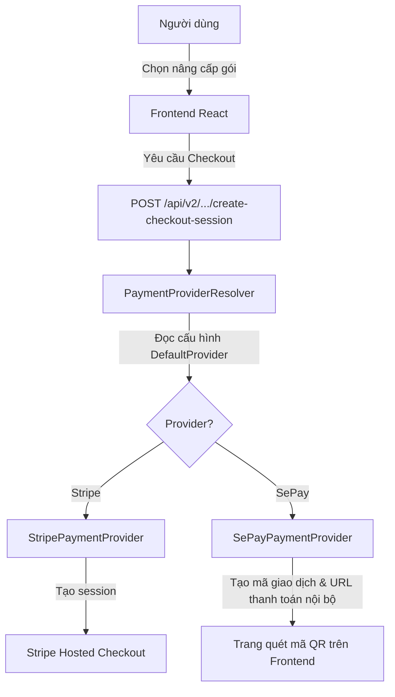

# Thiết Kế Tích Hợp Cổng Thanh Toán SePay & Luồng Subscription

Tài liệu này mô tả chi tiết phương án kiến trúc, bảo mật, luồng UI/UX và cơ chế quản lý để tích hợp cổng thanh toán **SePay** (chuyển khoản ngân hàng tự động đối soát tại Việt Nam) song song với **Stripe** (thanh toán quốc tế), hỗ trợ 14 ngày dùng thử (trial) và quản lý gói cước không cần trang quản trị (Admin).

---

## 1. Kiến Trúc Tích Hợp Song Song (SePay & Stripe Coexistence)

Hệ thống hiện tại đã áp dụng mô hình **Strategy Pattern** với interface [IPaymentProvider](file:///d:/Code/Syncra/be/src/Syncra.Application/Interfaces/IPaymentProvider.cs) và lớp điều hướng [PaymentProviderResolver](file:///d:/Code/Syncra/be/src/Syncra.Infrastructure/Services/PaymentProviderResolver.cs). Điều này giúp việc tích hợp SePay song song với Stripe rất sạch sẽ và dễ dàng kích hoạt/hủy kích hoạt.

### Sơ đồ luồng xử lý


### Cách thức chuyển đổi nhanh:
1.  **Cấu hình biến môi trường (`.env` hoặc `appsettings.json`)**:
    *   `Payment__DefaultProvider=sepay` (khi muốn dùng SePay cho thị trường Việt Nam).
    *   `Payment__DefaultProvider=stripe` (khi muốn dùng Stripe cho thị trường quốc tế).
2.  Hệ thống sẽ tự động khởi tạo đúng provider tương ứng. Code của Stripe được giữ nguyên trong `StripePaymentProvider` và sẵn sàng hoạt động lại bất cứ lúc nào chỉ bằng việc đổi cấu hình.

---

## 2. Tài Liệu Tích Hợp SePay API & Webhooks

SePay hoạt động theo cơ chế lắng nghe biến động số dư tài khoản ngân hàng của bạn và gửi tín hiệu Webhook về server của ứng dụng.

### A. Tạo Mã QR Chuyển Khoản Động (Tải ảnh từ SePay)
Trên Frontend, khi người dùng chọn thanh toán qua SePay, chúng ta sẽ hiển thị một mã QR tự điền thông tin bằng thẻ `` trỏ đến API của SePay:
```
https://qr.sepay.vn/img?acc={Số_Tài_Khoản}&bank={Mã_Ngân_Hàng}&amount={Số_Tien}&des={Mã_Thanh_Toán}&template=compact
```
*   **acc**: Số tài khoản ngân hàng thụ hưởng nhận tiền của bạn.
*   **bank**: Mã ngân hàng (ví dụ: `Vietcombank`, `MBBank`, `Vietinbank`).
*   **amount**: Số tiền chính xác của gói cước cần thanh toán.
*   **des (Nội dung)**: **Mã Thanh Toán** duy nhất (ví dụ: `SR1029`). Hệ thống đối soát tự động của SePay sẽ bóc tách mã này từ nội dung chuyển khoản để khớp giao dịch.

### B. Cấu Trúc Payload Webhook từ SePay
Khi khách hàng quét QR và chuyển khoản thành công, SePay sẽ gửi một `HTTP POST (JSON)` tới endpoint `/api/payments/webhook/sepay` với cấu trúc:
```json
{
  "id": 92704,
  "gateway": "Vietinbank",
  "transactionDate": "2026-06-19 14:05:00",
  "accountNumber": "1017588888",
  "code": "SR1029",
  "content": "SR1029 chuyen tien nang cap goi Pro",
  "transferType": "in",
  "transferAmount": 149000,
  "accumulated": 105000000,
  "referenceCode": "FT26170293812"
}
```

### C. Xác Thực Bảo Mật HMAC-SHA256 (Webhook Security)
Để tránh kẻ xấu giả mạo request gửi tiền ảo lên server, hệ thống bắt buộc phải xác thực chữ ký HMAC-SHA256 được SePay gửi kèm trong Header:
1.  **Đọc Header**:
    *   `X-SePay-Signature`: Chữ ký dạng `sha256={hex_hash}`.
    *   `X-SePay-Timestamp`: Thời gian gửi từ SePay (Unix timestamp).
2.  **Tính toán Chữ ký**:
    *   Chuỗi ký: `{timestamp}.{raw_body}` (sử dụng Raw Body chưa qua parse JSON).
    *   Tính mã băm HMAC-SHA256 bằng khóa bí mật `SePay__WebhookSecret` cấu hình trong `.env`.
3.  **So sánh**: Chữ ký tính toán phải trùng khớp với chữ ký nhận được.
4.  **Phản hồi SePay**: Nếu hợp lệ và xử lý thành công, server phản hồi **HTTP 200** với JSON: `{"success": true}`.

### D. Cơ Chế Chạy Thử (Test Mode / Sandbox)
*   **Kích hoạt**: Bật công tắc **Test Mode** trên trang quản trị [my.sepay.vn](https://my.sepay.vn). Giao diện SePay sẽ chuyển sang màu cam và chạy trên môi trường sandbox độc lập.
*   **Mô phỏng chuyển khoản**: Trong mục **Giao dịch**, nhấn **+ Mô phỏng giao dịch**, nhập số tiền và nội dung chuyển khoản (chứa mã giao dịch). SePay sẽ bắn Webhook giả lập tới server của bạn.
*   **Cấu hình trên Local Dev**: Sử dụng công cụ **ngrok** để mở cổng localhost (ví dụ: `ngrok http 8080`) lấy URL public (như `https://xyz.ngrok-free.app/api/payments/webhook/sepay`) cấu hình vào Webhook Url trên SePay Dashboard.

---

## 3. Thiết Kế Chi Tiết Giao Diện UI/UX Frontend (SePay Integration)

Để tối ưu hóa trải nghiệm người dùng đối với luồng thanh toán chuyển khoản ngân hàng (vốn có nhiều bước thủ công hơn thanh toán thẻ của Stripe), giao diện Frontend sẽ được thiết kế tỉ mỉ với phong cách **Glassmorphism** đặc trưng của Syncra, chia làm các cấu phần rõ ràng:

### A. Cập Nhật Trang Bảng Giá (Pricing Table - BillingSection.tsx)
*   **Huy hiệu Dùng thử (Trial Badge)**: Phía trên mỗi thẻ gói cước (Basic, Pro, Max) hiển thị nhãn nổi bật: `14 NGÀY DÙNG THỬ MIỄN PHÍ` (sử dụng màu xanh neon hoặc gradient bắt mắt).
*   **Nút Hành Động Động (Dynamic CTA Button)**:
    *   **Trường hợp 1 (Workspace chưa từng sử dụng Trial)**: Nút hiển thị `Bắt đầu dùng thử 14 ngày` (không yêu cầu nhập thông tin thanh toán). Nhấp vào sẽ gọi API kích hoạt gói dùng thử ngay lập tức.
    *   **Trường hợp 2 (Đã hết hạn Trial hoặc đang dùng gói trả phí khác)**: Nút hiển thị `Nâng cấp ngay` (hoặc `Gia hạn gói`). Nhấp vào sẽ tạo checkout session và chuyển hướng tới trang thanh toán QR.
*   **Thông báo trạng thái gói hiện tại**: Thẻ gói đang dùng sẽ có viền sáng gradient chạy xung quanh (glowing border) và hiển thị nhãn `Gói của bạn`.

### B. Trang Thanh Toán Chuyển Khoản (SePay Checkout Page)
Khi người dùng chọn nâng cấp và được chuyển đến luồng SePay, họ sẽ vào một trang chuyên biệt tối giản (Distraction-Free) tại đường dẫn `/app/workspaces/:workspaceId/billing/sepay-checkout`. 

#### 1. Khung Giao Diện Tổng Quan (Layout)
Trang được thiết kế dạng Card lớn bo góc, sử dụng hiệu ứng phủ kính (backdrop-filter: blur(16px)) trên nền tối sâu, chia làm 2 cột:

*   **Cột bên trái: Chi tiết hóa đơn & Hướng dẫn chuyển khoản**
    *   **Tóm tắt đơn hàng**: Tên gói nâng cấp (ví dụ: `Syncra Pro - 1 tháng`), giá gốc, giảm giá (nếu có), và tổng tiền thanh toán hiển thị với font chữ lớn nổi bật.
    *   **Thông tin tài khoản thụ hưởng**: Trình bày dưới dạng các ô nhập liệu giả định (Read-only inputs) để người dùng dễ nhìn:
        1.  *Ngân hàng thụ hưởng*: Tên ngân hàng kèm logo (ví dụ: Vietinbank).
        2.  *Số tài khoản*: `1017588888` kèm nút **[Sao chép]**.
        3.  *Tên chủ tài khoản*: `CONG TY CO PHAN SYNCRA`.
        4.  *Số tiền*: `149.000đ` kèm nút **[Sao chép]**.
        5.  *Nội dung chuyển khoản*: `SR1029` (Mã đơn hàng duy nhất) kèm nút **[Sao chép]**.
    *   **Nút Sao Chép Nhanh (1-Click Copy)**: Tích hợp icon sao chép cạnh mỗi trường thông tin. Khi nhấn, hiển thị Tooltip `"Đã sao chép!"` màu xanh lá trong 1.5 giây để phản hồi thị giác tốt cho người dùng.
    *   **Cảnh báo quan trọng**: Một hộp thông tin (Alert box) nền đỏ mờ, viền đỏ có nội dung: *"Lưu ý: Vui lòng chuyển khoản đúng số tiền và điền chính xác nội dung chuyển khoản ở trên để hệ thống kích hoạt tự động."*

*   **Cột bên phải: Mã VietQR động & Trạng thái giao dịch**
    *   **Khung hiển thị mã QR**: Ảnh QR động VietQR được sinh tự động từ SePay API đặt trong một khung viền bo góc có đổ bóng nhẹ. Khách hàng chỉ cần mở app ngân hàng quét mã này là toàn bộ thông tin (STK, ngân hàng, số tiền, nội dung) sẽ tự điền đầy đủ mà không cần gõ tay.
    *   **Trình đếm ngược (Countdown Timer)**: Thời gian hiệu lực của mã QR (ví dụ: `14:59`). Khi hết thời gian, ảnh QR mờ đi và xuất hiện nút *"Tạo lại mã thanh toán"*.
    *   **Hiển thị trạng thái kiểm tra (Real-time Status)**:
        *   Trạng thái **Đang chờ**: Dưới mã QR hiển thị vòng tròn xoay (Spinner) kèm dòng chữ: `Đang chờ thanh toán...` với hiệu ứng Pulse (nhấp nháy mờ dần màu vàng hổ phách).
        *   Trạng thái **Thành công**: Khi phát hiện giao dịch thành công, khung QR ẩn đi, thay thế bằng biểu tượng Checkmark xanh lục hoạt họa vẽ tròn (SVG Draw Animation), kèm dòng chữ `Thanh toán thành công!` màu xanh lá và hiệu ứng nổ pháo hoa chúc mừng (Confetti) phủ đầy màn hình. Sau 3 giây, tự động redirect người dùng trở lại dashboard.

### C. Bộ Lọc Chặn Tính Năng (Billing Gate Overlay)
Nếu Workspace đã hết hạn dùng thử hoặc hết hạn gói cước trả phí:
*   Khi người dùng truy cập các tính năng bị giới hạn (ví dụ: lên lịch bài viết, tạo thêm kết nối mạng xã hội), một giao diện overlay dạng kính mờ (frosted glass) sẽ bao phủ trang hiện tại.
*   Hiển thị thông báo thân thiện: `Gói dùng thử của bạn đã hết hạn` hoặc `Vượt quá giới hạn tính năng của gói hiện tại`.
*   Cung cấp hai nút bấm rõ ràng: `Nâng cấp/Gia hạn ngay` và `Quay lại trang Dashboard`.

### D. Cơ Chế Đồng Bộ Trạng Thái Tự Động (Auto-Polling & Lifecycle)
1.  **Bắt đầu Polling**: Ngay khi trang Checkout được tải, một hàm `setInterval` sẽ chạy ngầm cứ **mỗi 5 giây** gọi API `GET /api/v1/workspaces/{workspaceId}/subscription`.
2.  **Đối soát thành công**: Khi người dùng chuyển khoản -> SePay Webhook bắn về Backend -> Backend chuyển trạng thái Subscription thành `Active` -> Lần Polling tiếp theo sẽ nhận được dữ liệu subscription mới.
3.  **Hủy Polling & Dọn dẹp**: Ngay khi phát hiện Subscription có trạng thái `Active`, Frontend sẽ dừng hàm `setInterval`, kích hoạt hiệu ứng thành công và redirect người dùng đi để tránh lãng phí tài nguyên mạng.

---


---

## 4. Giải Pháp Quản Lý Giá Cả & Tên Gói Không Cần Trang Admin

Để thay đổi giá cước, tên gói, hoặc giới hạn tài khoản (ví dụ: nâng số bài đăng, thêm thành viên) nhanh chóng mà không cần code trang Admin, bạn có hai phương án tối ưu sau:

### Phương án 1: Sử Dụng Trình Quản Lý Bảng Của Supabase (Khuyên Dùng - Không Cần Code)
Ứng dụng hiện tại đang kết nối với cơ sở dữ liệu **Supabase Postgres** thông qua chuỗi kết nối trong tệp `.env`.
*   **Cách làm**: Bạn chỉ cần đăng nhập vào trang quản trị Supabase [supabase.com](https://supabase.com), chọn dự án của bạn và mở mục **Table Editor (Trình soạn thảo bảng)**, chọn bảng `Plans`.
*   **Ưu điểm**:
    *   Giao diện quản lý bảng của Supabase giống hệt một bảng Excel/Google Sheets. Bạn chỉ cần click đúp vào ô để sửa: `Name` (Tên gói), `PriceMonthly` (Giá tháng), `PriceYearly` (Giá năm), `MaxMembers` (Số thành viên tối đa), `MaxSocialAccounts` (Số tài khoản tối đa)... rồi nhấn Save.
    *   Mọi thay đổi sẽ có hiệu lực ngay lập tức trong ứng dụng mà không cần khởi động lại backend hay viết thêm bất kỳ dòng code admin nào.

### Phương án 2: Quản Lý Bằng File Cấu Cấu Hình JSON (`plans.json`)
Nếu muốn lưu trữ cấu hình trong mã nguồn để kiểm soát phiên bản qua Git:
*   **Cách làm**: Tạo một file `plans.json` trong thư mục project chứa thông tin các gói và giới hạn.
*   **Backend**: Khi backend khởi chạy (Startup), hệ thống sẽ đọc file `plans.json` này và tự động đồng bộ (Upsert) dữ liệu vào bảng `Plans` trong Database.
*   **Ưu điểm**: Dễ dàng thay đổi bằng cách sửa file JSON trên máy chủ hoặc commit qua git mà không sợ dữ liệu database bị lệch hoặc mất khi deploy lại.

---

## 5. Cơ Chế 14 Ngày Dùng Thử (14-Day Trial) Cho Mỗi Tài Khoản

Mỗi tài khoản/Workspace khi đăng ký sẽ được trải nghiệm dùng thử 14 ngày cho bất kỳ gói nào (BASIC, PRO, MAX) trước khi thanh toán.

### Luồng xử lý cho Stripe & SePay:
1.  **Với Stripe (Tự động gia hạn)**:
    *   Khi tạo Checkout Session, backend sẽ gửi tham số `TrialPeriodDays = 14` sang Stripe.
    *   Stripe sẽ tự quản lý ngày kết thúc dùng thử. Sau 14 ngày, nếu người dùng không hủy, Stripe sẽ tự động trừ tiền thẻ tín dụng của họ.
2.  **Với SePay (Không tự động gia hạn - Chuyển khoản thủ công)**:
    *   Do chuyển khoản ngân hàng không hỗ trợ tự động trừ tiền (auto-debit), chúng ta sẽ tự quản lý thời gian dùng thử trong database cục bộ.
    *   Khi người dùng chọn kích hoạt dùng thử gói PRO (hoặc khi tạo Workspace mới chọn gói dùng thử):
        *   Tạo bản ghi `Subscription` trong database với trạng thái `Trialing`.
        *   Thiết lập ngày hết hạn: `TrialEndsAtUtc = DateTime.UtcNow.AddDays(14)`.
        *   Hệ thống cho phép người dùng sử dụng đầy đủ tính năng của gói PRO trong 14 ngày mà không yêu cầu chuyển khoản trước.
3.  **Chặn tính năng khi hết hạn**:
    *   Khi đến ngày thứ 15 (`TrialEndsAtUtc < DateTime.UtcNow`), hệ thống sẽ kích hoạt bộ lọc bảo vệ (Billing Gate).
    *   Người dùng sẽ bị khóa các tính năng chính và hiển thị thông báo: *"Thời gian dùng thử gói PRO của bạn đã kết thúc. Vui lòng thanh toán chuyển khoản để tiếp tục sử dụng."* cùng nút dẫn tới trang quét mã QR SePay.
4.  **Chống lạm dụng dùng thử (Abuse Prevention)**:
    *   Mỗi Workspace/Tài khoản chỉ được kích hoạt dùng thử **duy nhất 1 lần** trong đời.
    *   Lưu vết trạng thái đã dùng thử bằng một trường boolean `HasUsedTrial` trên bảng `Workspace` hoặc bảng `SubscriptionHistory`. Nếu trường này là `true`, hệ thống sẽ ẩn nút "Dùng thử" và yêu cầu thanh toán ngay lập tức nếu họ chọn chuyển đổi gói.
